ToTo Pro
=============================

<!-- TOC -->

- [1. Wiki 知识库](#1-wiki-知识库)
- [2. 变更记录](#2-变更记录)
- [3. 安装教程](#3-安装教程)
- [4. 激活教程](#4-激活教程)
- [5. 使用教程](#5-使用教程)
    - [5.1. 建模辅助](#51-建模辅助)
        - [5.1.1. 信号线平直](#511-信号线平直)
        - [5.1.2. 信号线命名](#512-信号线命名)
        - [5.1.3. 信号线广播](#513-信号线广播)
        - [5.1.4. 清除信号线广播](#514-清除信号线广播)
        - [5.1.5. 端口重命名](#515-端口重命名)
        - [5.1.6. 端口序号设定](#516-端口序号设定)
        - [5.1.7. 端口风格化](#517-端口风格化)
        - [5.1.8. 清除端口风格化](#518-清除端口风格化)
        - [5.1.9. 端口名隐藏](#519-端口名隐藏)
        - [5.1.10. 端口名显示](#5110-端口名显示)
        - [5.1.11. 标定块风格化](#5111-标定块风格化)
        - [5.1.12. GotoFrom连线](#5112-gotofrom连线)
        - [5.1.13. 清除GtFm连线](#5113-清除gtfm连线)
        - [5.1.14. GotoFrom重命名](#5114-gotofrom重命名)
        - [5.1.15.  AutoSAR配置](#5115--autosar配置)
        - [5.1.16. ERT配置](#5116-ert配置)
        - [5.1.17. GotoFrom风格化](#5117-gotofrom风格化)
        - [5.1.18. 子系统重命名](#5118-子系统重命名)
        - [5.1.19. 数据类型](#5119-数据类型)
        - [5.1.20. 数据类型设定](#5120-数据类型设定)
    - [5.2. 单元测试](#52-单元测试)
        - [5.2.1. 创建测试用例](#521-创建测试用例)
        - [5.2.2. 测试用例导入](#522-测试用例导入)
        - [5.2.3. 选择测试用例](#523-选择测试用例)
        - [5.2.4. 运行](#524-运行)
        - [5.2.5. 需求覆盖统计](#525-需求覆盖统计)
    - [5.3. 架构设计](#53-架构设计)
        - [5.3.1. Interface导出](#531-interface导出)
        - [5.3.2. 数据字典枚举导出](#532-数据字典枚举导出)
        - [5.3.3. 数据字典枚举导入](#533-数据字典枚举导入)
        - [5.3.4. Interface导入功能](#534-interface导入功能)
        - [5.3.5. In/Out->Goto/Frm](#535-inout-gotofrm)
        - [5.3.6. XML Config](#536-xml-config)
        - [5.3.7. 公有字典合并](#537-公有字典合并)
        - [5.3.8. Auto SR Port](#538-auto-sr-port)
    - [5.4. 扩展功能](#54-扩展功能)
        - [5.4.1. 模型编译/停止编译](#541-模型编译停止编译)
        - [5.4.2. 代码copy](#542-代码copy)
        - [5.4.3. 数据字典关闭](#543-数据字典关闭)
        - [5.4.4. 命名修改](#544-命名修改)

<!-- /TOC -->

# 1. Wiki 知识库

[TBD]

# 2. 变更记录
| Ver. | Date| Author | Change Log | Notes |
|-----|------|---------|----------|-------|
|1.0.1 | 2020/8/21 | 姜世博 | 1. 添加 CreatModelFmDict ，可以根据数据字典创建模型，用于数据类型的统计和生成 |  |
|1.0.2 | 2020/10/20 | 姜世博 | 1. 添加 licence 校验功能 | |

# 3. 安装教程
选择 .mlappinstall 安装包文件

- step1 :  
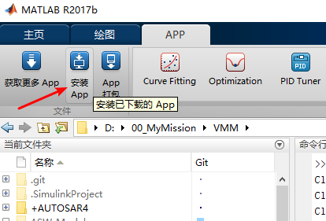

- step2 :  
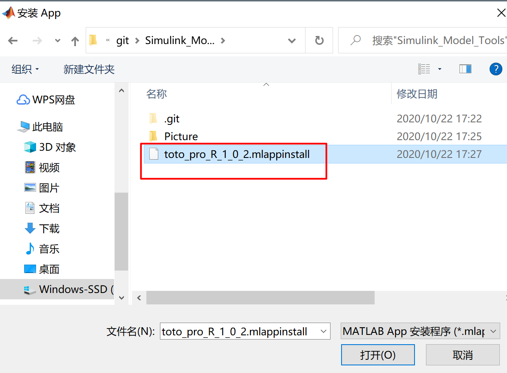

- step3 :  
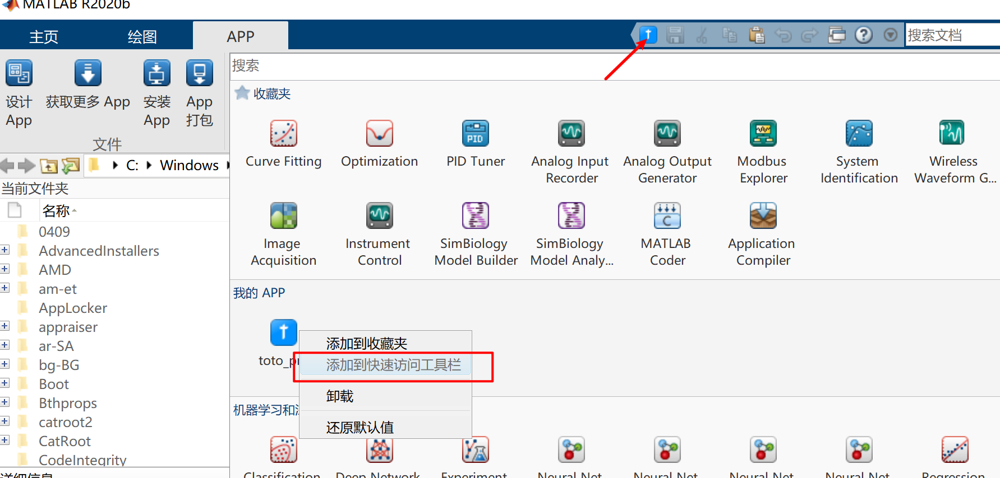

# 4. 激活教程

安装toto pro 之后，需要进行软件激活操作，遵循如下流程
>
> step1. 生成part No.   
> step2. 到 jiangshibo.cn 上购买 toto pro 软件，并同时提交part No.  
> step3. 系统会自动发送 ToToProLicense.xxxx 到用户邮箱  
> step4. 打开matlab，将license 拷贝至malab当前工作区，然后点击 license import  
> step5. 导入成功后会有显示，此时可以移出或删除ToToProLicense.xxxx 文件，license导入成功后会固化至系统，不会因删除 license而丢失激活信息
> 

- part no.

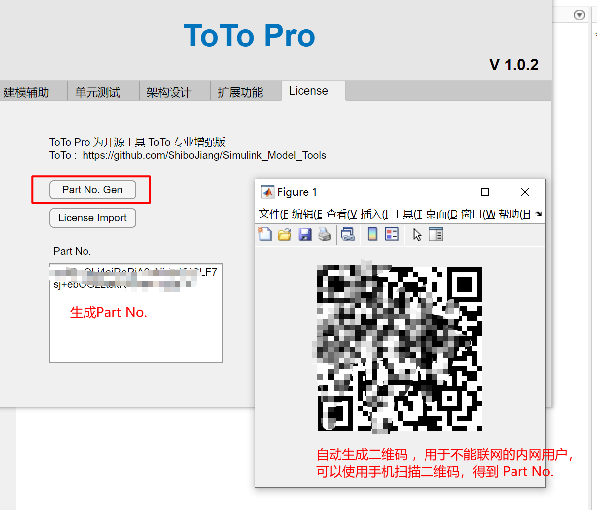

- License

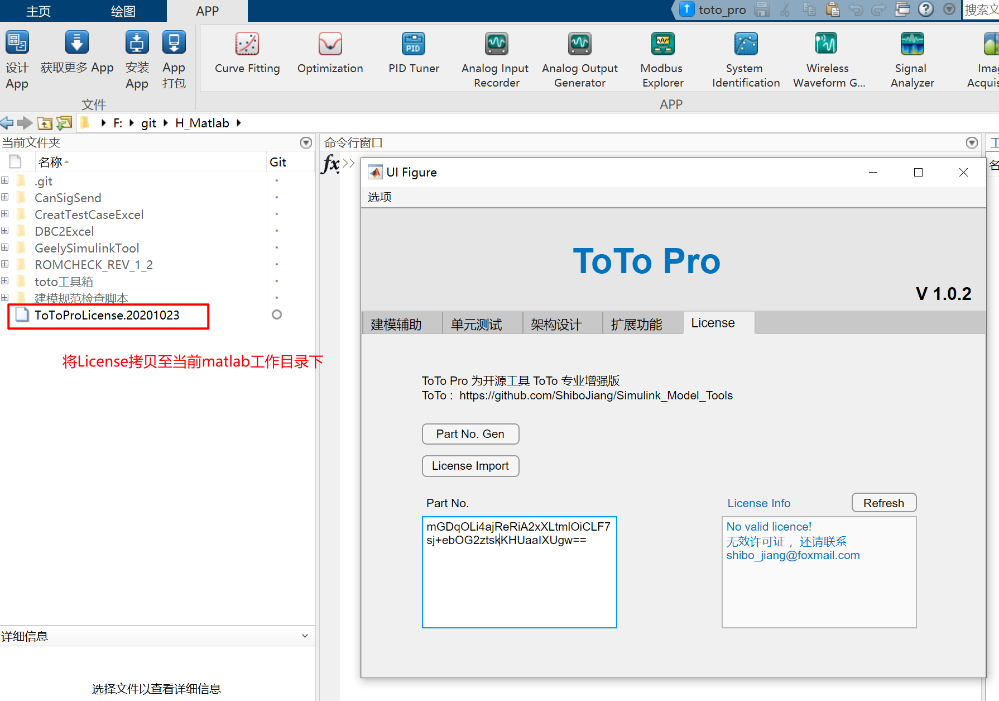

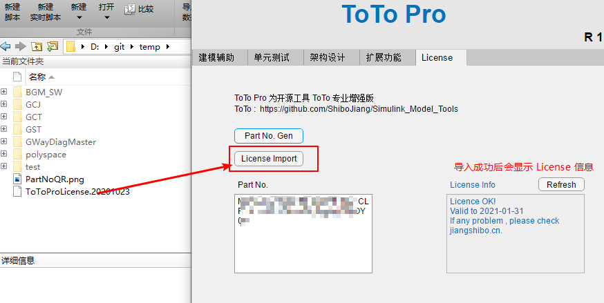

# 5. 使用教程

本工具包含建模辅助、单元测试、架构设计辅助功能，所有功能使用前提条件为已经打开模型，大部分功能为针对当前模型进行操作，还有少部分需要使用鼠标框选，或是仅对当前层有效。  
<font color=red>注意: </font>所有使用本工具对模型进行修改的操作，均不能够通过Ctrl + z回退，建议在使用工具前对模型进行git备份。  
工具界面预览如下:  
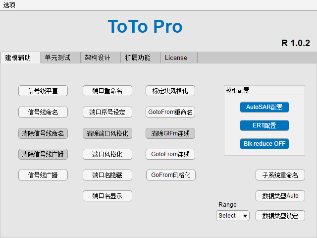

## 5.1. 建模辅助

此组工具包含建模搭建过程中，可以进行批量处理相应模块的工具。

### 5.1.1. 信号线平直

适用于子系统的输入输出端口，及连线调整，使用时需要先鼠标点击需要调整的子系统，然后在点击此按钮。

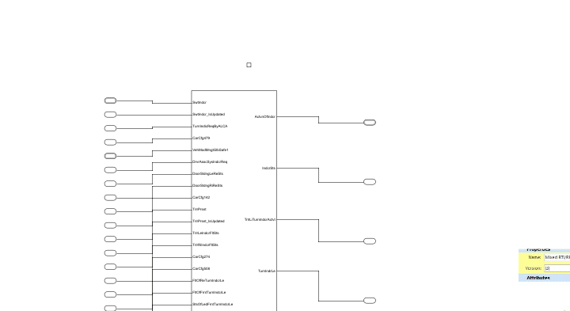

### 5.1.2. 信号线命名

适用于多个信号线的命名，此功能会根据信号线所连接的Input/Output,Goto/From,Signal Build 模块，进行相应的信号线命名。  
需要先用鼠标框选待命名的信号线，然后在点击此按钮。  
注意，如果信号线已经勾选了名称广播，则不能够使用此工具进行命名，需要消除信号线广播才能够用工具命名。  
  
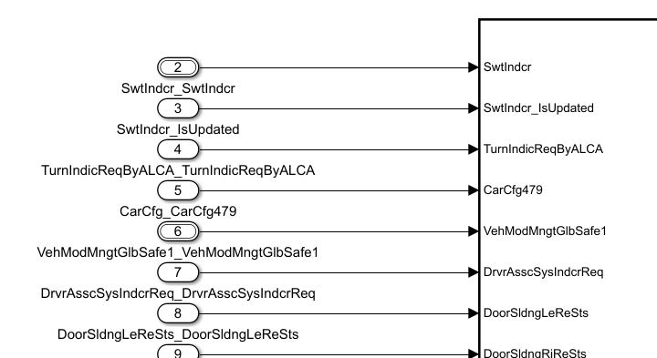


### 5.1.3. 信号线广播

此功能会将当前打开的模型，没有命名的信号线全部勾选`Show propagated signals`选项，进行信号广播显示。

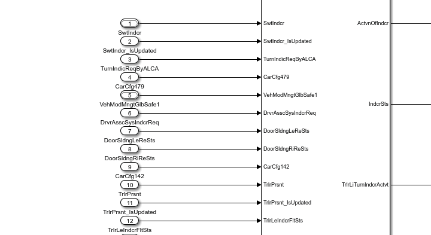

### 5.1.4. 清除信号线广播

此功能会将当前打开的模型，所有信号线都清除`Show propagated signals`选项。

### 5.1.5. 端口重命名

此功能会将模型**当前层**所有Inport/Outport模块的名称，按照所连接的信号线名称进行修改。

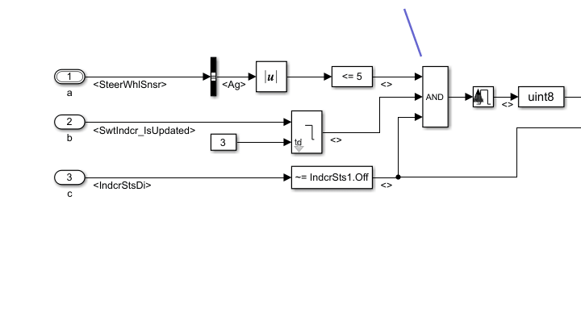

### 5.1.6. 端口序号设定

此功能会修改模型**当前层**所有Inport/Outport模块的序号，按照在模型中的位置，自上而下递增设定。  

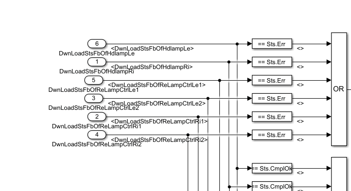


### 5.1.7. 端口风格化

此功能会修改模型**当前层**所有Inport/Outport模块的大小，改为圆形。


### 5.1.8. 清除端口风格化

此功能会修改模型**当前层**所有Inport/Outport模块的大小，改为默认形状。

### 5.1.9. 端口名隐藏

此功能会隐藏模型**当前层**所有Inport/Outport模块的名称。


### 5.1.10. 端口名显示

此功能会显示模型**当前层**所有Inport/Outport模块的名称。

### 5.1.11. 标定块风格化

此功能会将当前模型，所有标定量的Const模块改成如下的风格。

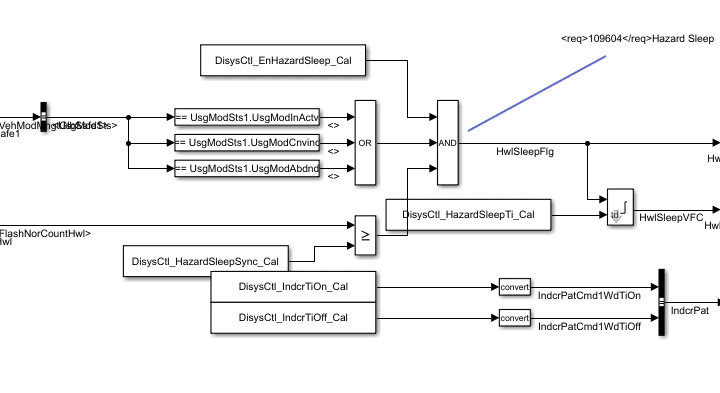


### 5.1.12. GotoFrom连线

此功能会针对当前层，所选择的 Goto 或 From 模块进行虚拟连线，效果如下:  
使用方法，选择需要进行虚拟连线的 Goto 或 From 模块，然后点击此按钮  

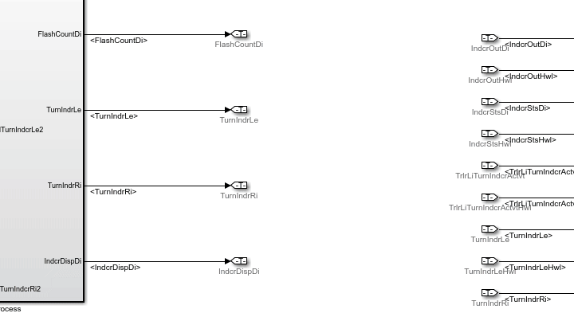

### 5.1.13. 清除GtFm连线

此功能会针对当前层，清除设置的Goto From 虚拟连线

### 5.1.14. GotoFrom重命名

此功能会针对当前层 所有Goto From模块，根据信号线上的名字进行模块Tag重命名

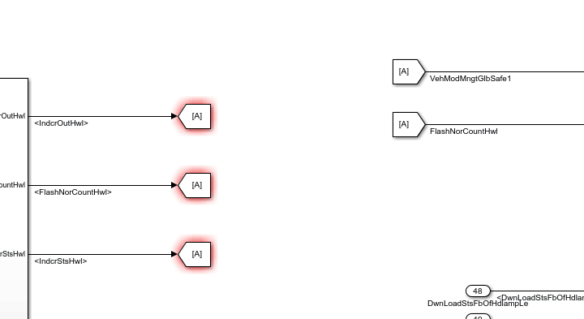

### 5.1.15.  AutoSAR配置
AutoSAR配置

具体配置项，查看如下文档：  

[基于Autosar的模型配置说明文档](./doc/基于Autosar的模型配置说明文档.md)

### 5.1.16. ERT配置

具体配置项，参考如下文档，唯一不同的就是生成目标为 ERT ，其它与Auotsar配置一致：  

[基于Autosar的模型配置说明文档](./doc/基于Autosar的模型配置说明文档.md)


### 5.1.17. GotoFrom风格化

针对当前打开的模型，把所有 Goto From 模块大小重新设定，改为 长20 ，宽16 的模块，并隐藏模块名称。


### 5.1.18. 子系统重命名

针对当前层的所有子系统，按照从左至右的位置进行自动添加序号命名 IndexNo_SystemName。使用此功能需要注意，要将所有需要命名的子系统，Mask 设置为off。  

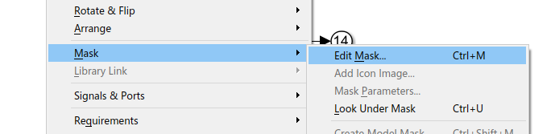  
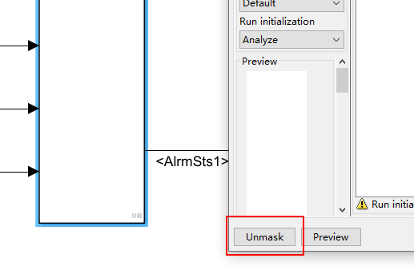  
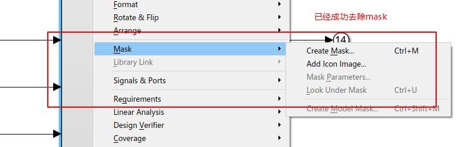  

### 5.1.19. 数据类型


此功能会将模块的输出数据类型设为 `Inherit: 
` ,方便修改数据类型。所设定的模块需要根据Range选项框内设定范围进行判定。

设定范围:

- Selet : 需要首先使用鼠标框选需要设定数据类型的模块，功能作用域仅限于所选模块
- Layer : 针对当前层所有输入/输出 模块进行设定，此范围默认保护顶层port，即若在模型顶层，此功能不会修改port数据类型。

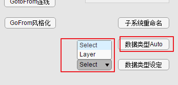  

### 5.1.20. 数据类型设定

此功能首先会编译模型，然后会读取模型port口正确数据类型，最后将编译后的数据类型写入模块输出数据类型进行固化，用于替代原模型中
 。所设定的模块需要根据Range选项框内设定范围进行判定。

设定范围:

- Selet : 需要首先使用鼠标框选需要设定数据类型的模块，功能作用域仅限于所选模块
- Layer : 针对当前层所有输入/输出 模块进行设定，此范围默认保护顶层port，即若在模型顶层，此功能不会修改port数据类型。

## 5.2. 单元测试

使用单元测试工具前，需要先自行创建TestHarness，并且打开已经创建好的Testharness模型，浏览界面处于模型顶层（包含 SigBuilder模块的一层）。  
**注意：** 创建Harness的子系统，不能够包含Function-Call 的触发输入端口，需要所有输入输出为普通端口都子系统才行。  
使用单元测试工具需要保证模型具备如下条件：  
1. 使用数据字典进行数据管理
2. 目录结构为如下所示:  

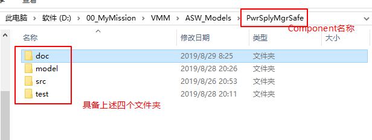

如下为创建TestHarness示例:  

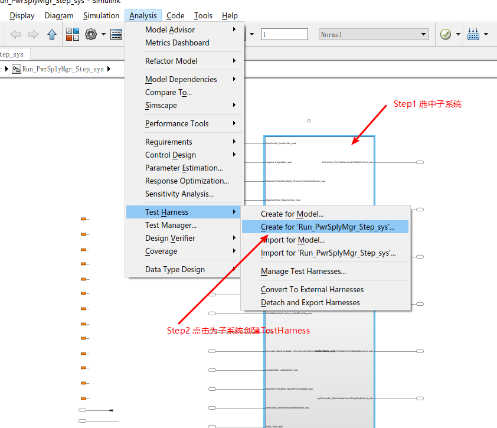

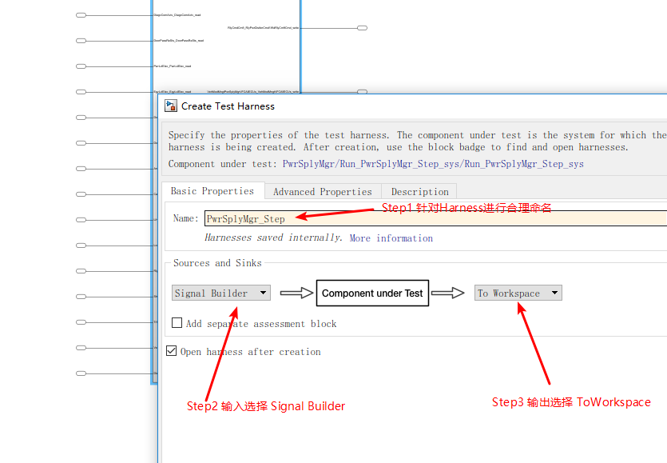

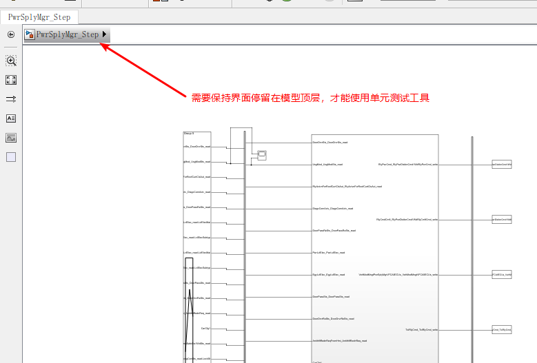

### 5.2.1. 创建测试用例

在TestHarness顶层目录下，点击此按钮，会创建单元测试用例模板Excel，包含标定量信息，和TestCase_1页面，如下图所示。  
需要注意的是，创建测试用例的同时会搜寻信号的取值，整个耗时较长，在创建过程中不要操作正在生成的表格，以免产生错误。

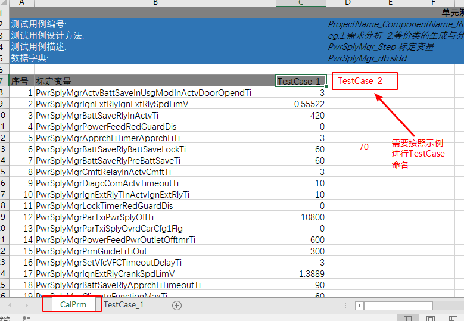

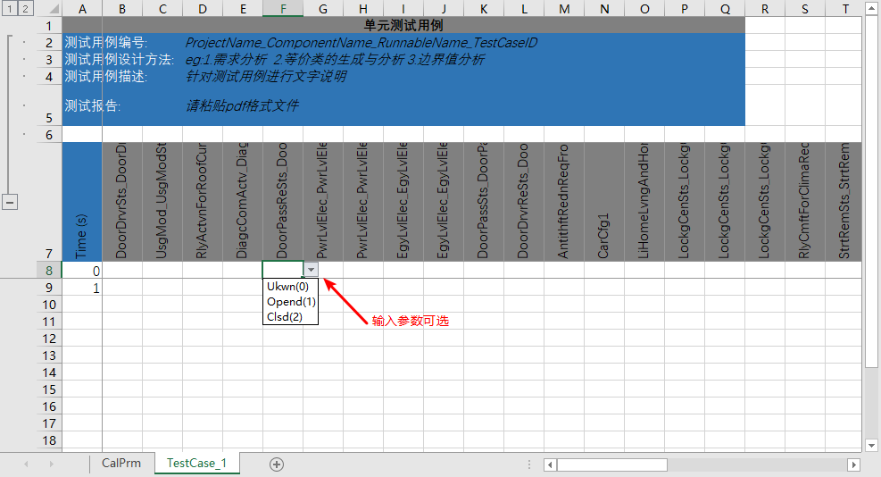

### 5.2.2. 测试用例导入

点击此功能，根据界面提示进行测试用例导入，仍需要保持在模型顶层进行操作。


### 5.2.3. 选择测试用例

在All TestCase一栏中选取所需要进行测试的用例，然后点击`>>`按钮进行选择确认。

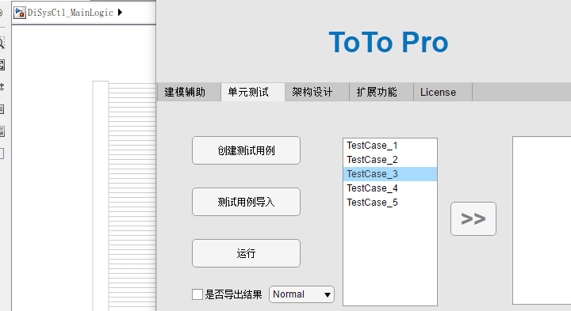

### 5.2.4. 运行

根据实际情况勾选是否导出结果，以及是否生成覆盖度测试报告，然后点击运行。  
- 是否导出结果: 勾选后点击运行，会把测试结果导回Excel，使用此功能需要关闭已经打开的测试用例Excel。  

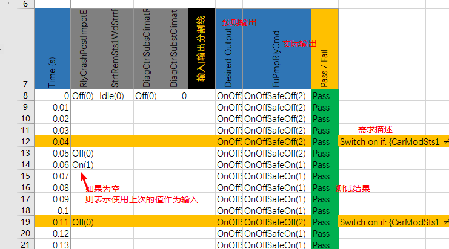  

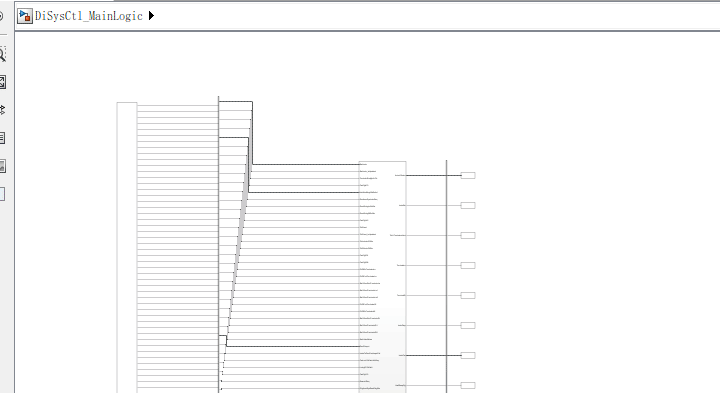

- 是否生成报告: 勾选后会统计所运行的单元测试用例的总覆盖度，包含标定量修改带来的覆盖度计算。

### 5.2.5. 需求覆盖统计

统计所选模型和单元测试用例中所标注的需求，标注格式需要严格遵守命名规范，及`<req>ReqId</req>Req description`，统计完成后会生成markdown格式报告，并存入 test 文件夹下。  

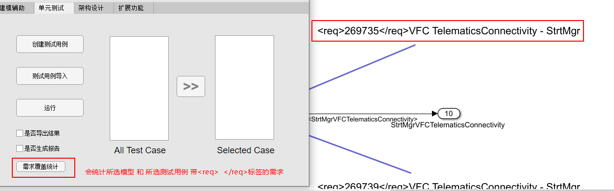  

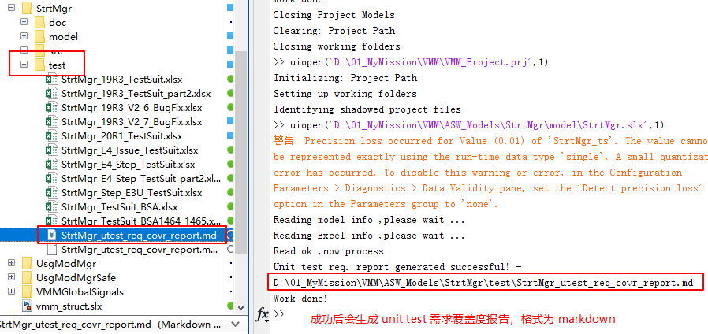  

## 5.3. 架构设计

本组功能可以辅助模型接口设计以及统计等相关功能。

### 5.3.1. Interface导出

此功能要求打开模型为
SAR配置的模型，点击后会生成接口信息表格，包含模型变更历史，SR接口信息，标定量信息等要素。  
变更历史信息生成，要求在模型 History一栏中按照如下格式进行填写:  

```
|Ver  | Change        Log                                   | Time     | Author|
|-----|-----------------------------------------------------|----------|-------|
|0.1| 1. 修复Convenience、ACTIVE、Drving模式下重新上          |2018/12/28|Shibo Jiang   |
       BatterySaver Relay无法吸合问题。模型在这几种模式状态可以
       保持batterySaver Relay吸合。              
|0.2| 1. 修复问题：在inactive模式下，LiHomeLvlngAndHomeSafe满足|2018/12/28|Shibo Jiang   |
        条件后无法吸合batterySaver Relay，更不能延时5min断开。
|0.3| NA                                                     |2019/3/6  |shibo jiang |
|0.4| 1. BattSaveRly的逻辑全部切换成VCC的模型，                 |2019/3/20 |shibo jiang |
         并在其基础上将2.0的需求添加进去
      2. RlyCmftCmd的逻辑全部切换成VCC的模型，并在此基础上，
         将GEEA2.0的需求添加进去。
```

生成Interface表格如下:

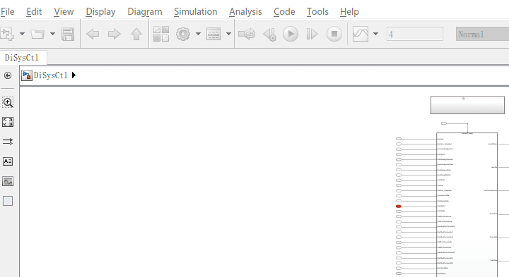

### 5.3.2. 数据字典枚举导出

此功能会导出所选择的数据字典中，所有枚举数据类型，导出为可运行的 m脚本。  

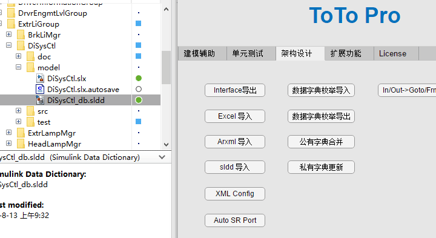  

导出脚本为:

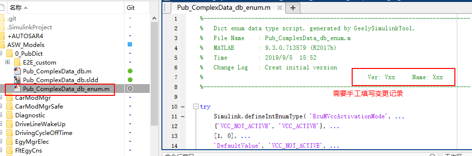  

### 5.3.3. 数据字典枚举导入

此功能会将 m脚本中定义的枚举数据类型，导入到所选数据字典中。

### 5.3.4. Interface导入功能

此功能会导入 选择的arxml 或 excel 文件，并创建相应模型，  
excel 格式如下  
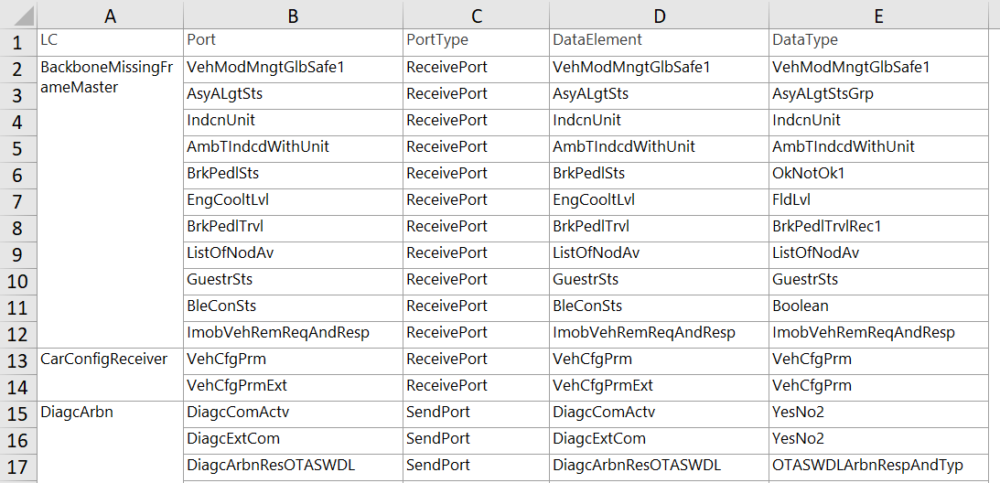  

### 5.3.5. In/Out->Goto/Frm

此功能会针对当前层，所有输入输出端口，如果名称一致，或者名称重复被系统自动添加数字后缀，则会替换此输入/输出 为 From/Goto 模块。  
需要注意，使用此功能需要严格遵守端口的命名规则，即 (port name)_(element name)，且port name 与 element name 名称一致，否则此功能会出现bug。

### 5.3.6. XML Config
配置 ARXML Operation ，按照如下格式模板进行设定：  
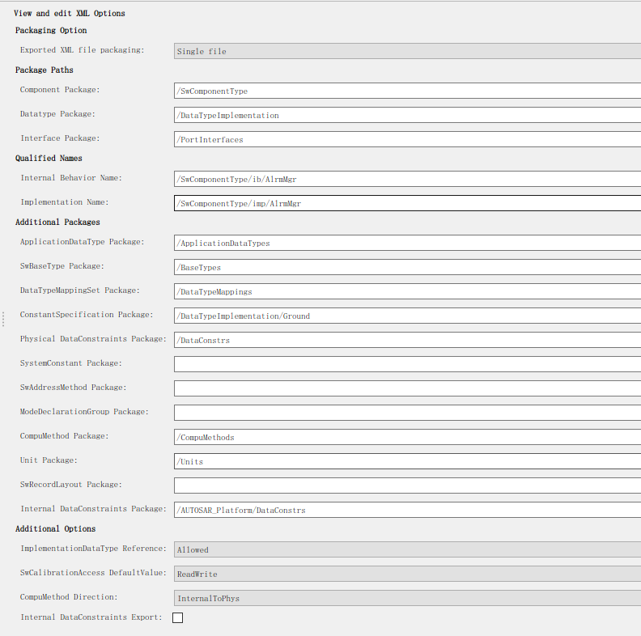  

### 5.3.7. 公有字典合并
此功能会抽取私有字典的 struct enum typedef 变量，统一合并到公有数据字典中。

### 5.3.8. Auto SR Port
 SR Port

此功能会针对当前模型，自动添加
SAR SR port ，interface，element，并且与相应输入输出端口进行映射。  
需要注意的是，要求模型最外层端口命名按照 PortName_ElementName 的形式，否则无法使用此功能。  
若输入端口为Function-call类型，也不会进行SR添加。  
当前此功能仅添加SR port。CS Port，runnable ，
sar package 不会自动添加。  

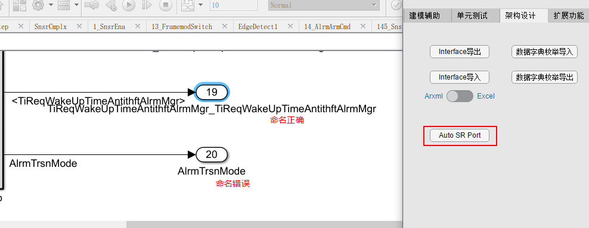  

## 5.4. 扩展功能

此选项卡下工具为非主体功能或非模型操作相关功能。

### 5.4.1. 模型编译/停止编译
针对单元测试时出现问题导致模型卡死可以使用停止编译尝试解决，原方案必须重启matlab;   
针对带有CS接口的模型，可以使用模型编译进行可运行测试，原方案需要使用build生成代码测试，时间较长。  
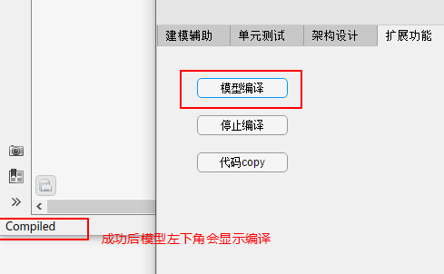  

### 5.4.2. 代码copy
此功能可以将所选择的文件夹中 ,SwcName.c SwcName.h SwcName.a2l SwcName.arxml 四个文件拷贝到对应模块的 src 文件夹中，方便搜集代码。  
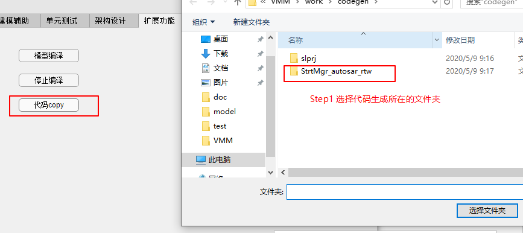  
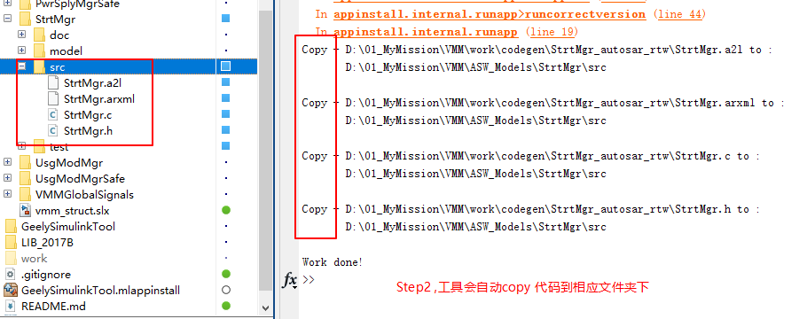  

### 5.4.3. 数据字典关闭
此功能会强制关闭所有打开的数据字典，应对部分情况下更改了数据字典，但是模型中已经打开了之前的数据字典，导致模型运行不通过的问题。

### 5.4.4. 命名修改
此功能会将模型所有变量列到excel里，在excel中修改名称后会同步到模型所有使用该字符串的模块，包含数据字典，constant模块，输入输出，goto from 等。