# **适用于AUTOSAR的配置选项规范**
---------------------------------------
  
- [1. Solver 求解器的设定](#1-solver-求解器的设定)
- [2. Data Import/Export 数据输入输出设定](#2-data-importexport-数据输入输出设定)
- [3. Optimization 优化参数设定](#3-optimization-优化参数设定)
	- [3.1. Optimization->Signals and Parameters 信号和变量优化设定](#31-optimization-signals-and-parameters-信号和变量优化设定)
	- [3.2. Optimization->Stateflow 参数优化设定](#32-optimization-stateflow-参数优化设定)
- [4. Diagnostics 诊断设定](#4-diagnostics-诊断设定)
	- [4.1. Diagnostics->Sample Time 采样时间诊断设定](#41-diagnostics-sample-time-采样时间诊断设定)
	- [4.2. Diagnostics->Data Validity 数据有效性诊断设定](#42-diagnostics-data-validity-数据有效性诊断设定)
	- [4.3. Diagnostics->Type Conversiion 类型转换诊断设定](#43-diagnostics-type-conversiion-类型转换诊断设定)
	- [4.4. Diagnostics->Connectivity 连接诊断设定](#44-diagnostics-connectivity-连接诊断设定)
	- [4.5. Diagnostics->Compatibility 互换性诊断设定](#45-diagnostics-compatibility-互换性诊断设定)
	- [4.6. Diagnostics->Model Referencing 模型引用诊断设定](#46-diagnostics-model-referencing-模型引用诊断设定)
	- [4.7. Diagnostics->Stateflow 诊断设定](#47-diagnostics-stateflow-诊断设定)
- [5. Hardware Implementation 执行硬件设定](#5-hardware-implementation-执行硬件设定)
- [6. Model Referencing 模型引用设定](#6-model-referencing-模型引用设定)
- [7. Simulation Target 仿真目标设定](#7-simulation-target-仿真目标设定)
- [8. Code Generation 代码生成设定](#8-code-generation-代码生成设定)
	- [8.1. Code Generation->Report 代码生成报告设定](#81-code-generation-report-代码生成报告设定)
	- [8.2. Code Generation->Comments 代码生成注释设定](#82-code-generation-comments-代码生成注释设定)
	- [8.3. Code Generation->Symbols 代码生成符号标记设定](#83-code-generation-symbols-代码生成符号标记设定)
	- [8.4. Code Generation->Custom Code 自定义代码设定](#84-code-generation-custom-code-自定义代码设定)
	- [8.5. Code Generation->Interface 代码接口设定](#85-code-generation-interface-代码接口设定)
	- [8.6. Code Generation->Code Style 代码生成风格设定](#86-code-generation-code-style-代码生成风格设定)
	- [8.7. Code Generation->Verification 代码验证设定](#87-code-generation-verification-代码验证设定)
	- [8.8. Code Generation->Templates 生成代码模板设定](#88-code-generation-templates-生成代码模板设定)
	- [8.9. Code Generation->Code Placement 代码放置位置设定](#89-code-generation-code-placement-代码放置位置设定)
	- [8.10. Code Generation->Data Type Replacement 生成代码数据类型替换设定](#810-code-generation-data-type-replacement-生成代码数据类型替换设定)
	- [8.11. Code Generation->Memory Sections 生成代码内存块设定](#811-code-generation-memory-sections-生成代码内存块设定)
	- [8.12. Code Generation->AUTOSAR Code Generation Options 生成适配AUTOSAR代码的配置选项](#812-code-generation-autosar-code-generation-options-生成适配autosar代码的配置选项)

---------------------------------
- 根据hisl（高完整性系统建模）文档进行配置项优化，并将hisl相关规则进行文档链接。开始编写自动配置的脚本
- 根据model advisor中DO-178C/DO-331（航空机载软件建模规范）相关配置项进行优化，根据JMAAB中部分规则进行配置优化，修改脚本，增加不同模型兼容性
- 根据Mathworks培训，适配mablab2017b，确认 ZeroExternalMemoryAtStartup, ZeroInternalMemoryAtStartup,NoFixptDivByZeroProtection 选项设置，新增 ConditionallyExecuteInputs, OptimizeBlockIOStorage,BufferReuse,ExpressionFolding ,DefaultParameterBehavior (选择Inlined), BlockReduction (不能选择，需要通过死逻辑检查来规避该项),GlobalBufferReuse,BooleanDataType,EfficientFloat2IntCast 选项设置，增加代码效率，减少可调试性。  
讲师提到数据类型转换模块，溢出设定，与建模规范 jc 0628 ,jc 0651 描述一致。 
2019/8/28  姜世博

# 1. Solver 求解器的设定

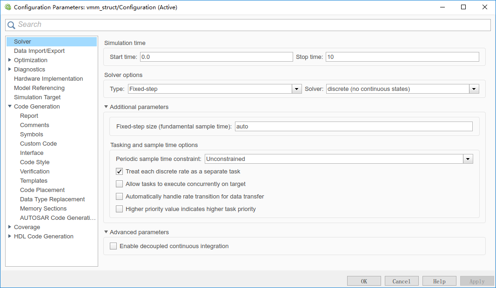

1. Simulation time: 仿真和运行的开始时间，结束时间，单位为s，根据实际情况进行设定。(可参考[hisl_0040][hisl_0040])
2. Solver options: 求解器选项，分别选择 `Fixed-step` 和 `discrete` ，代表 生成代码需要一个固定步骤的离散求解器。(可参考[hisl_0041][hisl_0041])
3. Fixed-step size: 固定步长的时间设置，单位为s，根据开发电脑和实际运行的硬件性能进行设定，尽量与产品最终状态保持一致。
4. Periodic sample time constraint: 采样周期约束，如模型不涉及重用，则选择 `unconstraint` ，如果使用模型引用来重用，则选择 `Ensure sample time independent` 。(参考规则[hisl_0042][hisl_0042]，参考解释[Periodic sample time constraint][Periodic sample time constraint])
5. Treat each discrete rate as a separate task:采样周期对应的任务模式，是否允许不用采样频率的模块在模型中，作为独立的task运行，此处选择`启用`，默认选项为不启用。(参考解释[Treat each discrete rate as a separate task][Treat each discrete rate as a separate task])
6. Automatically handle rate transition for data transfer: 自动处理数据传输的速率转换，选择 `不启用` ，如果勾选并启用自动转换功能，有可能会在代码生成阶段生成一些没有相应模型构造的代码，不可控也不符合可追溯性。(参考规则[hisl_0042][hisl_0042]，参考解释[Automatically handle rate transition for data transfer][Automatically handle rate transition for data transfer])
7. Higher priority value indicates higher task priority: 高优先级数值对应高优先级任务，选择 `不启用` ，这意味着小的数值代表高优先级任务，数值1和2中1代表着更高的优先级。(参考规则[hisl_0042][hisl_0042]，参考解释[Higher priority value indicates higher task priority][Higher priority value indicates higher task priority])

# 2. Data Import/Export 数据输入输出设定

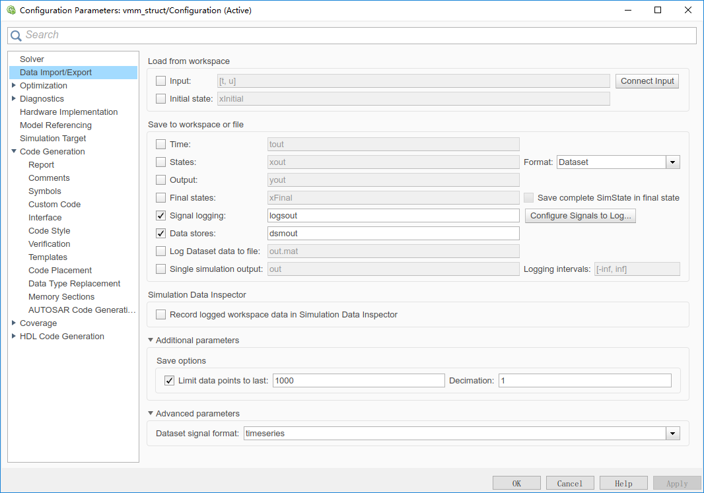

1. Input: 输入，从工作区加载数据，模型一般不需要此功能，选为 `不启用` 。(参考解释[Input][Input])
2. Initial state: 初始状态，从工作区加载模型的初始状态，一般不用此功能，选为 `不启用` 。(参考解释[Initial state][Initial state])
3. Time: 时间，在运行或仿真时把时间变量保存到工作区，一般不用此功能，选为 `不启用` 。(参考解释[Time][Time])
4. States: 状态，在运行或仿真过程中保存状态数据到指定的变量，一般不用此功能，选为 `不启用` 。(参考解释[States][States])
5. Format: 格式，按照默认选择 `Dataset` 。(参考解释[Format][Format])
6. Output: 输出，将输出比你昂保存到工作区，一般不用此功能，选为 `不启用` 。(参考解释[Output][Output])
7. Final states:最终状态，将模型最终的状态记录并保存在工作区，一般不用此功能，选为 `不启用` 。(参考解释[Final states][Final states])
8. Signal logging: 信号记录，将运行中信号记录并存至工作区，一般 `启用` 此功能以便于仿真时调试问题。(参考解释[Signal logging][Signal logging])
9. Data stores: 数据存储，储存Simulink.SimulationData.Dataset格式的数据，勾选 `启用` 后，不影响代码生成。(参考解释[Data stores][Data stores])
10. Log dataset data to file: 将数据记录到MAT文件，一般 `不启用` 此功能。(参考解释[Log dataset data to file][Log dataset data to file])
11. Singal simulation output: 仿真结果的单个输出,一般 `不启用` 此功能。(参考解释[Singal simulation output][Singal simulation output])
12. Record logged workspace data in Simulation Data Inspector: 在Simulation Data Inspector中记录记录的工作区数据，模型开发及验证阶段可以 `启用` ，以便于在 仿真数据监视器 中查看数据和调试，此处不影响代码生成。(参考解释[Record logged workspace data in Simulation Data Inspector][Record logged workspace data in Simulation Data Inspector])
13. Limit data points: 限制到Matlab工作区导出的数据点，一般按照默认 `启用` 此功能，可以减少电脑不必要的内存占用，此选项不影响代码生成。(参考解释[Limit data points][Limit data points])

# 3. Optimization 优化参数设定

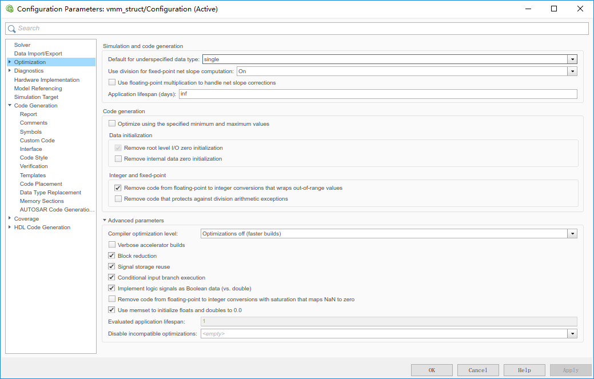

1. Default for underspecified data type: 没有指定的默认数据类型，共有 `double` 和 `signal` 可选，此设置影响代码生成，需要根据处理器的支持与否来选择，此处推荐选择 `single` 以便节省空间。(参考解释[Default for underspecified data type][Default for underspecified data type])

2. Use division for fixed-point net slope computation:使用除法对于特定的定点数的净斜率计算进行优化，此项选择`on`，需要注意的是hisl_0060规则推荐选择on。(参考解释[Use division for fixed-point net slope computation][Use division for fixed-point net slope computation]，参考规则[hisl_0060][hisl_0060])

- ***疑问:选项配置没有实际影响，和官方文档参考有差别***

3. Use floating-point multiplication to handle net slope corrections: 使用浮点乘法来处理网络斜率校正，默认 `不启用` 此项优化。(参考解释[Use floating-point multiplication to handle net slope corrections][Use floating-point multiplication to handle net slope corrections])
4. Application lifespan (days): 在定时器溢出之前，模型中的模块能够运行多少天，所填数字为大于0的标量值，最大为inf，此处要求填写 `inf` 。(参考解释[Application lifespan][Application lifespan]，参考规则[hisl_0048][hisl_0048])

5. 

***模型中使用事件，并允许绝对时间-参考8.5.6项设置-才会有影响，否则不对生成代码产生影响***

5. Optimize using the specified minimum and maximum values: 使用模型中信号和参数的指定最小值和最大值来优化生成的代码，设为 `不启用` 该优化来减少冗余代码和空间。(参考解释[Optimize using the specified minimum and maximum values][Optimize using the specified minimum and maximum values])
6. Remove root level I/O zero initialization: ZeroExternalMemoryAtStartup 删除根级别的 I/O 赋0初始化，此项默认 `启用` 。(参考解释[Remove root level I/O zero initialization][Remove root level I/O zero initialization])
7. Remove internal data zero initialization: ZeroInternalMemoryAtStartup 删除内部数据赋0的初始化，为了适配AutoSAR，此项选择 `不启用` 。(参考解释[Remove internal data zero initialization][Remove internal data zero initialization]，参考规则[hisl_0052][hisl_0052])

- 左侧为勾选启用，右侧为勾选不启用，可以看出启用此项 不会生成中间状态变量的初始化代码，此时使用变量定义时进行初始化。

8. Remove code from floating-point to integer conversions that wraps out-of-range values: 删除超出范围的浮点到整形数转换，根据会议评审，此处选择 `不启用`，需要注意的是hisl_0053规则建议选择“启用” 。(参考解释[Remove code from floating-point][Remove code from floating-point]，参考规则[hisl_0053][hisl_0053])

- 左边为启用，右边为不启用，转换是否超范围在搭建模型阶段进行测试和保证，不需要生成相关保护代码。

9. Remove code that protects against division arithmetic exceptions: NoFixptDivByZeroProtection 不生成对于除0保护的代码，此处 `不启用`，目的为生成除0保护的相关代码。(参考解释[Remove code that protects][Remove code that protects]，参考规则[hisl_0054][hisl_0054])

10. Conditional input branch execution: ConditionallyExecuteInputs针对条件判断语句进行折叠优化，勾选后条件满足才会运行相应分支代码，此处 `启用`，目的为增加代码运行效率。(20190828 mathwork培训建议)

11. Signal storage reuse: OptimizeBlockIOStorage 输入输出信号储存类型可复用，此处 `启用` ，目的为增加代码运行效率。(20190828 mathwork培训建议)

12. Block reduction: BlockReduction 删除无法运行的模块代码，此处 `不启用`，即不删除模型中死逻辑的代码，通过静态检查中的死逻辑检查来覆盖此项，保证模型和代码的一致，以及不要误删预留逻辑。(20190828 mathwork培训，与讲师建议不一致)

13. Implement logic signals as Boolean data (vs. double): BooleanDataType 布尔数据类型的启用与默认转换，此处 `启用` ，目的为增加代码运行效率。(20190828 mathwork培训建议)

14. Remove code from floating-point to integer conversions that wraps out-of-range values: EfficientFloat2IntCast 浮点数据计算过程中整形化转换，此处 `启用` ，目的为增加代码运行效率。(20190828 mathwork培训建议)

## 3.1. Optimization->Signals and Parameters 信号和变量优化设定

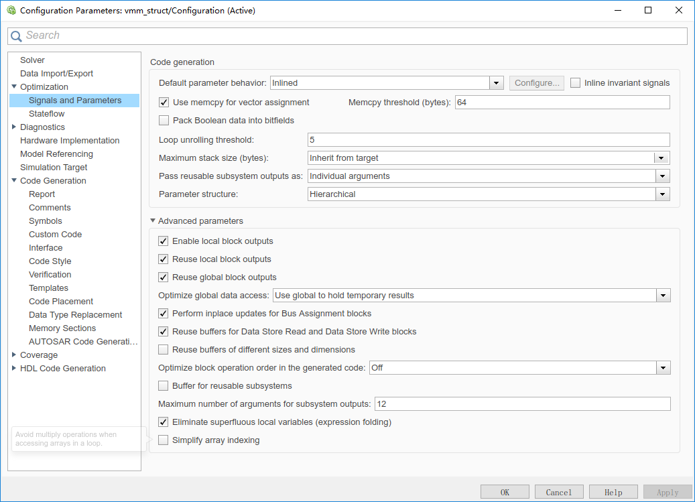

1. Default parameter behavior: 默认参数行为，此项选择 `Inlined` ，将数字块参数转换为生成的代码中的常量内联值，即代码不给表示数字的参数分配内存，减少全局RAM使用并提高生成代码的效率。(参考解释[Default parameter behavior][Default parameter behavior])
2. Inline invariant signals: 不变信号量作为内联，此处勾选 `不启用` ，目的是将固定的信号量生成const类型的标定量。(参考解释[Inline invariant signals][Inline invariant signals])

- 左边为不启用，右边为启用，可以发现启用内联信号量优化后有可能会将 期望保存为const类型的标定量优化没，所以不启用这项优化

3. Use memcpy for vector assignment: 使用memcpy进行矢量的分配，此处勾选 `启用` 优化，目的是对于一些特定的for循环，会使用memcpy进行替换。(参考解释[Use memcpy for vector assignment][Use memcpy for vector assignment])
4. Memcpy threshold (bytes): Memcpy阈值(字节)，在生成的代码中指定替换成memcpy的最小数组大小（以字节为单位），此处使用默认值 `64` 即可。(参考解释[Memcpy threshold][Memcpy threshold])
5. Pack Boolean data into bitfields: 将布尔数据打包成位域，此处按照默认 `不启用` 这条优化，如果启用，则会将布尔变量作为位段方式进行储存，节省ROM，但是运行时效率会变低。(参考解释[Pack Boolean data into bitfields][Pack Boolean data into bitfields])
6. Loop unrolling threshold: 循环展开阈值，制定代码生成for循环的最小循环数，此处按照默认设为 `5` ，根据规则hisl_0051要求为2以上，而默认参数为5，所以决定采默认值。(参考解释[Loop unrolling threshold][Loop unrolling threshold]，参考规则[hisl_0051][hisl_0051])
7. Maximum stack size (bytes): 堆栈上限值(字节)，此处按照默认选择即可，`Inherit from target` ，目的为根据Simulink编译器自动分配。(参考解释[Maximum stack size][Maximum stack size])
8. Pass reusable subsystem outputs as: 设定可重用子系统通过什么输出，此处选择 `Individual arguments` ，将可重用的子系统输出作为局部变量，此选项对比Structure reference可增加运行时效率。(参考解释[Pass reusable subsystem outputs as][Pass reusable subsystem outputs as])

- 左边为选择`Individual arguments`，右边为选择`Structure reference`代码对比，采用左边的方式能够减少内存并增加代码执行速度，采用右边的方式可以对重用函数输出值进行分开保存，并能够存储上次的值。

9. Parameter structure: 参数结构，此处选择默认选项 `Hierarchical` ，目的是对于特定的子系统生成独立的参数结构。(参考解释[Parameter structure][Parameter structure])

10. Reuse local block outputs :BufferReuse 局部输出变量可复用优化，此处 `启用` ，目的为增加代码运行效率。(20190828 mathwork培训建议)

11. Eliminate superfluous local variables (expression folding): ExpressionFolding 表达式折叠，优化局部自动变量，此处 `启用` ，目的为增加代码运行效率。(20190828 mathwork培训建议)

12. Default parameter behavior: DefaultParameterBehavior 默认变量的表现形式，主要针对直接填写数字的Constant模块，如果选为Tunnable 则代码生成时会把数字转为自动变量，并在程序中使用变量，若选为Inlined，则会优化为立即数，对于枚举、标定类型的constant模块没有影响，此处选 `Inlined`，目的为增加代码运行效率。(20190828 mathwork培训建议)

13. Reuse global block outputs: GlobalBufferReuse 全局输出变量可复用优化，此处 `启用` ，目的为增加代码运行效率。(20190828 mathwork培训建议)

## 3.2. Optimization->Stateflow 参数优化设定

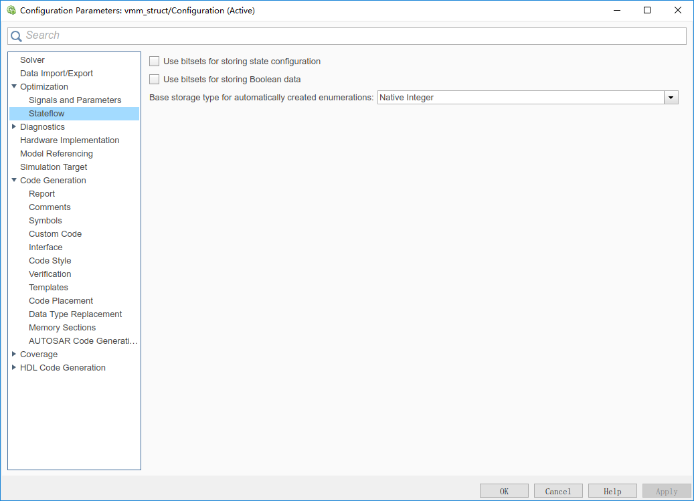

1. Use bitsets for storing state configuration: 使用位段来储存状态格局，此处勾选 `不启用` 该优化，若勾选该优化，虽然会节省ROM，但同时会降低运行时效率，。(参考解释[Use bitsets for storing][Use bitsets for storing])
2. Use bitsets for storing Boolean data: 使用位段储存布尔变量，此处 `不启用` 这项优化，这样能够更快的读取及运算布尔变量，若启用优化则会减少内存使用但是需要更多的指令来访问布尔变量。(参考解释[Use bitsets for storing Boolean data][Use bitsets for storing Boolean data])
3. Base storage type for automatically created enumerations: 自动创建枚举类型的储存类型，此处按照默认值 `Native Integers` 设定即可，目的为根据目标自动选择的整形类型。(参考解释[Base storage type for automatically created enumerations][Base storage type for automatically created enumerations])

# 4. Diagnostics 诊断设定

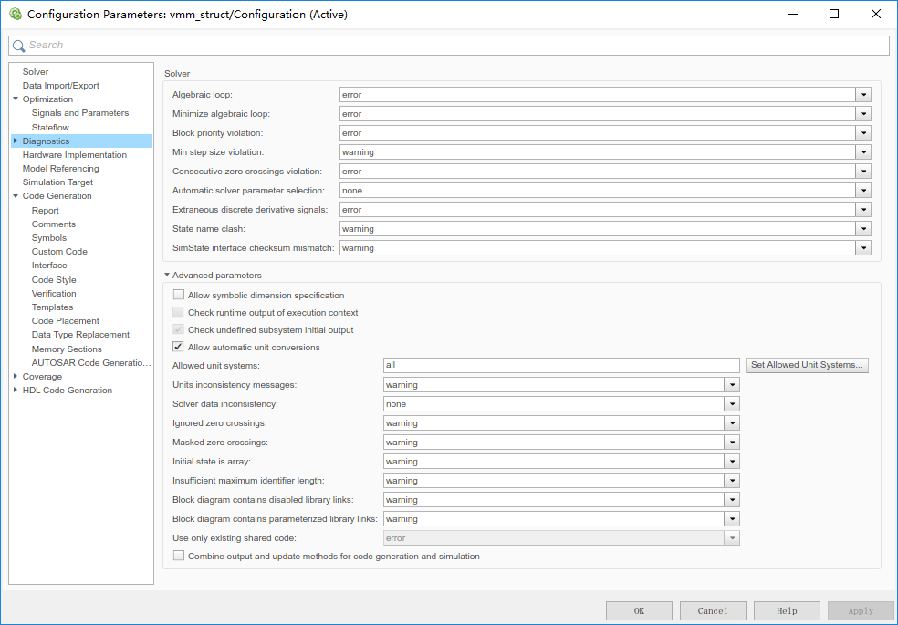

1. Algebraic loop: 代数环检测，设为 `error` 。(参考解释[Algebraic loop][Algebraic loop]，参考规则[hisl_0043][hisl_0043])
2. Minimize algebraic loop: 最小化代数环，设为 `error` 。(参考解释[Minimize algebraic loop][Minimize algebraic loop]，参考规则[hisl_0043][hisl_0043])
3. Block priority violation: 模块优先级违规检测，设为 `error` 。(参考解释[Block priority violation][Block priority violation]，参考规则[hisl_0043][hisl_0043])
4. Min step size violation: 最小步长违规检测，设为 `warning` 。(参考解释[Min step size violation][Min step size violation])
5. Consecutive zero-crossings violation: 连续过0违规检测，设为 `error` 。(参考解释[Consecutive zero-crossings violation][Consecutive zero-crossings violation])
6. Automatic solver parameter selection: 自动求解器参数选择，此处设为 `error`。(参考解释[Automatic solver parameter selection][Automatic solver parameter selection]，参考规则[hisl_0043][hisl_0043])
7. Extraneous discrete derivative signals: 外部导入的离散信号检测，设为 `error` 。(参考解释[Extraneous discrete derivative signals][Extraneous discrete derivative signals])
8. State name clash: 状态名冲突，设为 `warning` 。(参考解释[State name clash][State name clash]，参考规则[hisl_0043][hisl_0043])
9. SimState interface checksum mismatch: SimState接口校验和不匹配，设为 `warning` 。(参考解释[SimState interface checksum mismatch][SimState interface checksum mismatch])

## 4.1. Diagnostics->Sample Time 采样时间诊断设定

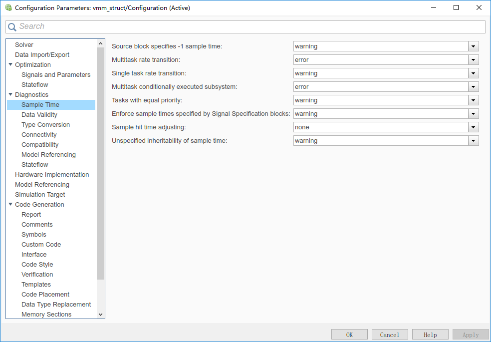

1. Source block specifies -1 sample time: 信号源模块设定了-1的采样时间，设为 `error` 。(参考解释[Source block specifies -1 sample time][Source block specifies -1 sample time]，参考规则[hisl_0044][hisl_0044])
2. Multitask rate transition: 多任务速率转换，设为 `error` 。(参考解释[Multitask rate transition][Multitask rate transition]，参考规则[hisl_0044][hisl_0044])
3. Single task rate transition: 单任务速率转换，设为 `error` 。(参考解释[Single task rate transition][Single task rate transition]，参考规则[hisl_0044][hisl_0044])
4. Multitask conditionally executed subsystem: 多任务根据条件执行子系统，设为 `error` 。(参考解释[Multitask conditionally executed subsystem][Multitask conditionally executed subsystem]，参考规则[hisl_0044][hisl_0044])
5. Tasks with equal priority: 同优先级任务，设为 `error` 。(参考解释[Tasks with equal priority][Tasks with equal priority]，参考规则[hisl_0044][hisl_0044])
6. Enforce sample times specified by Signal Specification blocks: 根据信号模块特殊设定进行了采样周期的强制变换，设为 `error` 。(参考解释[Enforce sample times specified][Enforce sample times specified]，参考规则[hisl_0044][hisl_0044])
7. Sample hit time adjusting: 采样调用时间调整，设为 `none` 。(参考解释[Sample hit time adjusting][Sample hit time adjusting])
8. Unspecified inheritability of sample time: 采样时间没有设定为继承模式，设为 `error` 。(参考解释[Unspecified inheritability of sample time][Unspecified inheritability of sample time]，参考规则[hisl_0044][hisl_0044])

## 4.2. Diagnostics->Data Validity 数据有效性诊断设定

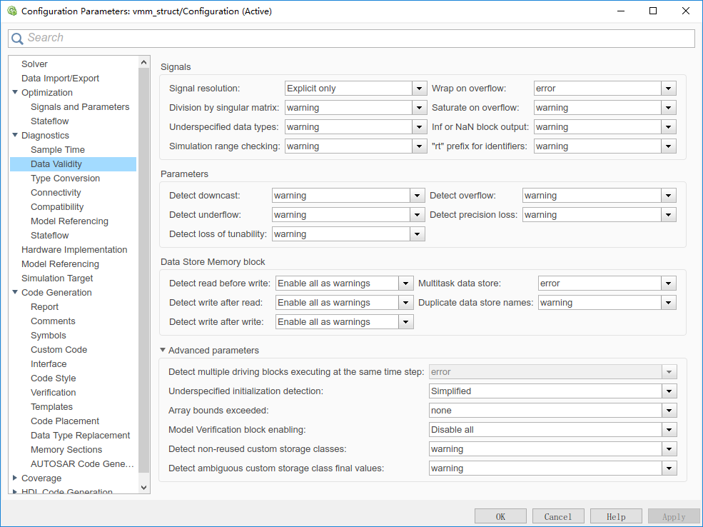

1. Signal resolution: 信号分辨率，此处按照默认设置 `Explicit only` ，目的为不执行隐式信号分辨率，仅显式指定信号分辨率。(参考解释[Signal resolution][Signal resolution])
2. Wrap on overflow: 封装溢出，设置为 `error` 。(参考解释[Wrap on overflow][Wrap on overflow])
3. Division by singular matrix: 奇异矩阵除法，选择 `error` ，在model adviser里勾选 Check diagnostic settings ignored during accelerated model reference simulation也可以进行此项检查。(参考解释[Division by singular matrix][Division by singular matrix])
4. Saturate on overflow: 饱和溢出，此处设置默认值 `error` 。(参考解释[Saturate on overflow][Saturate on overflow])
5. Underspecified data types: 未指定的数据类型，此处按照默认设置 `error` 。(参考解释[Underspecified data types][Underspecified data types])
6. Inf or NaN block output: Inf或NaN块输出，此处设置 `error` 。(参考解释[Inf or NaN block output][Inf or NaN block output])
7. Simulation range checking: 仿真范围检查，此处设置 `error` 。(参考规则[Simulation range checking][Simulation range checking])
8. "rt" prefix for identifiers: 标识符rt作为前缀，按照默认设置 `error` 。(参考解释["rt" prefix for identifiers]["rt" prefix for identifiers])
9. Detect downcast: 损失型的强制转换检查，设为 `error` 。(参考解释[Detect downcast][Detect downcast]，参考规则[hisl_0302][hisl_0302])
10. Detect overflow: 向上溢出检测，设为 `error` 。(参考解释[Detect overflow][Detect overflow]，参考规则[hisl_0302][hisl_0302])
11. Detect underflow: 检测向下溢出，设为 `error` 。(参考解释[Detect underflow][Detect underflow]，参考规则[hisl_0302][hisl_0302])
12. Detect precision loss: 检测精度损失，设为 `error` 。(参考解释[Detect precision loss][Detect precision loss]，参考规则[hisl_0302][hisl_0302])
13. Detect loss of tunability: 可调性丢失检测，设为 `error` 。(参考解释[Detect loss of tunability][Detect loss of tunability])
14. Detect read before write: 在写入之前检测读取，按照默认设置 `Enable all as errors` ，仅检测局部变量。(参考解释[Detect read before write][Detect read before write])
15. Multitask data store: 多任务数据存储，按照默认设为 `error` 。(参考解释[Multitask data store][Multitask data store])
16. Detect write after read: 读取后检测写入，此处按照默认设置 `Enable all as errors` 。(参考解释[Detect write after read][Detect write after read])
17. Duplicate data store names: 重复的数据储存名称，此处设置 `error` 。(参考解释[Duplicate data store names][Duplicate data store names]，参考规则[Check Data Store Memory blocks][Check Data Store Memory blocks])
18. Detect write after write: 写入之后检测写入，此处按照默认设置 `Enable all as errors` 。(参考解释[Detect write after write][Detect write after write])

## 4.3. Diagnostics->Type Conversiion 类型转换诊断设定

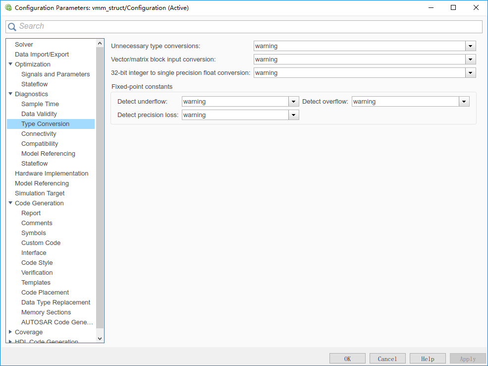

1. Unnecessary type conversions: 不必要的类型转换，设置 `warning` 。(参考解释[Unnecessary type conversions][Unnecessary type conversions])
2. Vector/matrix block input conversion: 矢量/矩阵块输入转换，设为 `error` 。(参考解释[Vector/matrix block input conversion][Vector/matrix block input conversion]，参考规则[hisl_0309][hisl_0309])
3. 32-bit integer to single precision float conversion: 32位整数到单精度浮点转换，按照默认设为 `warning` 。(参考解释[32-bit integer to single][32-bit integer to single])
4. Detect underflow: 向下溢出检测，按照默认设置 `none` 。(参考解释[Detect underflow][Detect underflow1])
5. Detect overflow: 向上溢出检测，按照默认设置 `none` 。(参考解释[Detect overflow][Detect overflow1])
6. Detect precision loss: 精度损失检测，按照默认设置 `none` 。(参考解释[Detect precision loss][Detect precision loss1])

## 4.4. Diagnostics->Connectivity 连接诊断设定

1. Signal label mismatch: 信号标签不匹配，设为 `error` 。(参考解释[Signal label mismatch][Signal label mismatch]，参考规则[hisl_0306][hisl_0306])
2. Unconnected block input ports: 未连接的输入端口，设为 `error` 。(参考解释[Unconnected block input ports][Unconnected block input ports]，参考规则[hisl_0306][hisl_0306])
3. Unconnected block output ports: 未连接的输出端口，设为 `error` 。(参考解释[Unconnected block output ports][Unconnected block output ports]，参考规则[hisl_0306][hisl_0306])
4. Unconnected line: 包含未连接的行或不匹配的Goto、From块，设为 `error` 。(参考解释[Unconnected line][Unconnected line]，参考规则[hisl_0306][hisl_0306])
5. Unspecified bus object at root Outport block: 顶层输出端口连接了未定义的总线，设为 `error` 。(参考解释[Unspecified bus object at root Outport block][Unspecified bus object at root Outport block]，参考规则[hisl_0307][hisl_0307])
6. Element name mismatch: 元素名称不匹配，设为 `error` 。(参考解释[Element name mismatch][Element name mismatch]，参考规则[hisl_0307][hisl_0307])
7. Bus signal treated as vector: 总线信号作为矢量进行处理，按照默认设置为 `none` 。(参考解释[Bus signal treated as vector][Bus signal treated as vector])
8. Non-bus signals treated as bus signals: 非总线信号被当做了总线信号进行处理，设为 `error` 。(参考解释[Non-bus signals treated as bus signals][Non-bus signals treated as bus signals]，参考规则[hisl_0307][hisl_0307])
9. Repair bus selections: 总线选择器查错和修复，设为 `Warn and repair` 。(参考解释[Repair bus selections][Repair bus selections]，参考规则[hisl_0307][hisl_0307])
10. Invalid function-call connection: 无效的函数调用连接，设为 `error` 。(参考翻译[Invalid function-call connection][Invalid function-call connection]，参考规则[hisl_0308][hisl_0308])
11. Context-dependent inputs: 与上下文有关的输入，设为 `Enable all as errors` 。(参考解释[Context-dependent inputs][Context-dependent inputs]，参考规则[hisl_0308][hisl_0308])

## 4.5. Diagnostics->Compatibility 互换性诊断设定

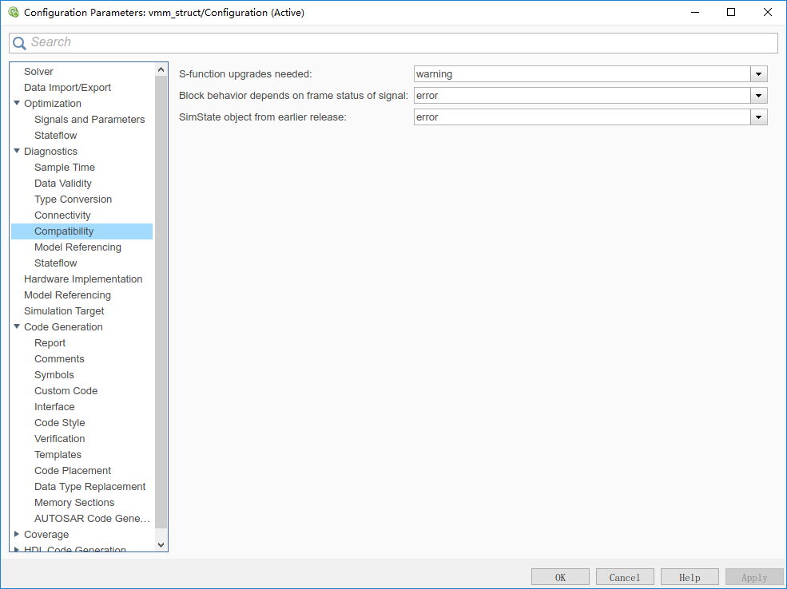

1. S-function upgrades needed: 需要S函数升级，设为 `error` 。(参考解释[S-function upgrades needed][S-function upgrades needed]，参考规则[hisl_0301][hisl_0301])
2. Block behavior depends on frame status of signal: 模块行为由信号帧决定，按照默认设为 `error` 。(参考解释[Block behavior depends][Block behavior depends])
3. SimState object from earlier release: 使用了早期版本的SimState，按照默认设为 `error` 。(参考解释[SimState object from earlier release][SimState object from earlier release])

## 4.6. Diagnostics->Model Referencing 模型引用诊断设定

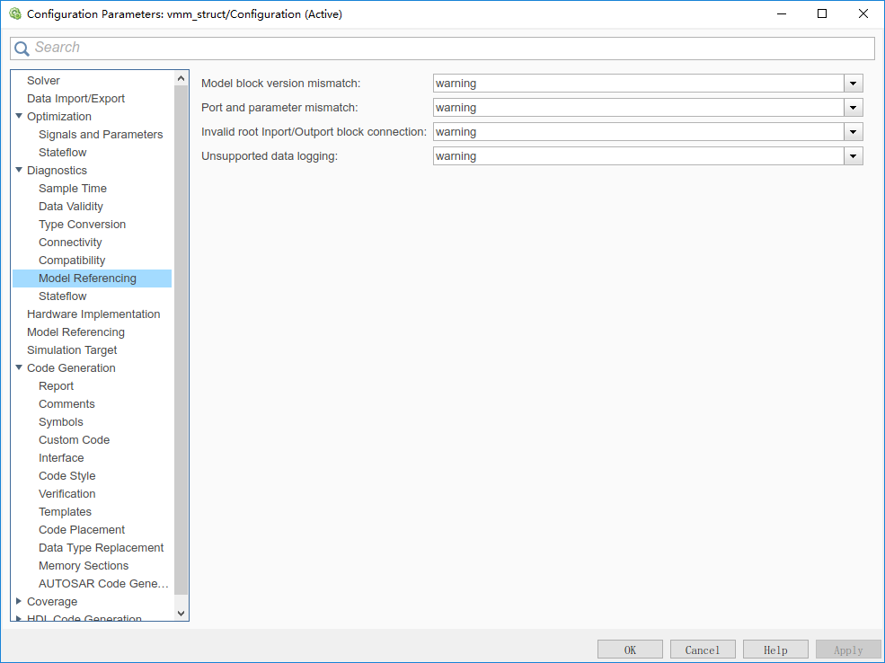

1. Model block version mismatch: 模块版本不匹配，设为 `error` 。(参考解释[Model block version mismatch][Model block version mismatch]，参考规则[hisl_0310][hisl_0310])
2. Port and parameter mismatch: 端口参数比匹配，设为 `error` 。(参考解释[Port and parameter mismatch][Port and parameter mismatch]，参考规则[hisl_0310][hisl_0310])
3. Invalid root Inport/Outport block connection: 顶层无效的输入/输出端口连接，设为 `error` 。(参考解释[Invalid root Inport/Outport block connection][Invalid root Inport/Outport block connection]，参考规则[hisl_0310][hisl_0310])
4. Unsupported data logging: 不支持的数据记录，设为 `error` 。(参考解释[Unsupported data logging][Unsupported data logging]，参考规则[hisl_0310][hisl_0310])

## 4.7. Diagnostics->Stateflow 诊断设定

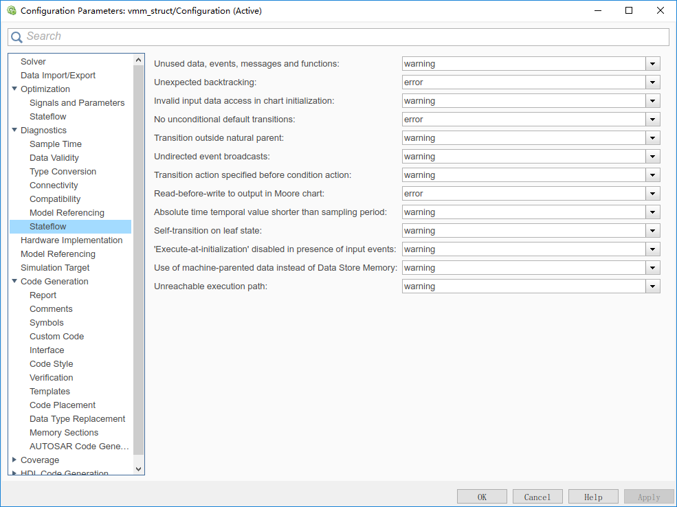

1. Unused data, events, messages, and functions: 未使用的数据，事件，消息和函数。按照默认设为 `warning` 。(参考解释[Unused data, events, messages, and functions][Unused data, events, messages, and functions])
2. Unexpected backtracking: 非预期的回溯，设为 `error` 。(参考解释[Unexpected backtracking][Unexpected backtracking]，参考规则[hisl_0311][hisl_0311])
3. Invalid input data access in chart initialization: chart初始化中有无效的数据访问，设为 `error` 。(参考解释[Invalid input data access in chart initialization][Invalid input data access in chart initialization]，参考规则[hisl_0311][hisl_0311])
4. No unconditional default transitions: 没有无条件转换，设为 `error` 。(参考解释[No unconditional default transitions][No unconditional default transitions]，参考规则[hisl_0311][hisl_0311])
5. Transition outside natural parent: 在父状态之外转换诊断，设为 `error` 。(参考解释[Transition outside natural parent][Transition outside natural parent])
6. Undirected event broadcasts: 无指向的事件广播，按照默认设置 `warning` 。(参考解释[Undirected event broadcasts][Undirected event broadcasts])
7. Transition action specified before condition action: 在条件动作前定义了转换动作，按照默认设为 `warning` 。(参考解释[Transition action specified before condition action][Transition action specified before condition action])
8. Read-before-write to output in Moore chart: moore chart使用先前的输出值确定当前状态，按照默认设为 `warning` 。(参考解释[Read-before-write to output in Moore chart][Read-before-write to output in Moore chart])
9. Absolute time temporal value shorter than sampling period: 绝对时间比采样周期短，按照默认设为 `warning` 。(参考解释[Absolute time temporal value shorter than sampling period][Absolute time temporal value shorter than sampling period])
10. Self transition on leaf state: 单个叶状态下的自转换操作，按照默认设为 `warning` 。(参考解释[Self transition on leaf state][Self transition on leaf state])
11. Execute-at-Initialization disabled in presence of input events:当选择状态在初始化运行时，检测输入事件的触发是否被抑制，按照默认设为 `warning` 。(参考解释[Execute-at-Initialization disabled in presence of input events][Execute-at-Initialization disabled in presence of input events])
12. Use of machine-parented data instead of Data Store: 检测使用了电脑的内存作为数据存储，而不是data store模块，按照默认设为 `warning` 。(参考解释[Use of machine-parented data instead of Data Store][Use of machine-parented data instead of Data Store])
13. Unreachable execution path: 执行不到的路径，按照默认设为 `warning` 。(参考解释[Unreachable execution path][Unreachable execution path])

# 5. Hardware Implementation 执行硬件设定

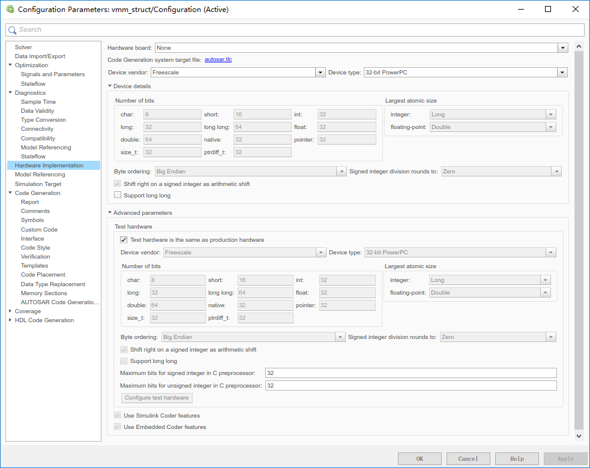

- 根据实际硬件进行选择，举例: Hardware board->`none`, Device vendor->`Infineon`, Device Type->`TriCore`
- Largest atomic size->integer: 最小整数，根据硬件进行选择，举例 `Char`。
- Largest atomic size: floating-point: 最小浮点，举例 `Float` 。
- Byte ordering: 字节排序，默认小端模式 `Little Endian` 。
- Signed integer division rounds to: 有符号的整数除数，选择 `Zero` ，两个有符号整数相除，要得到整数进行舍入时，选择更接近0的数。(参考解释[Signed integer division rounds to][Signed integer division rounds to]，参考规则[hisl_0060][hisl_0060])
- Shift right on a signed integer as arithmetic shift: 有符号整数右移是否作为算术法则右移，描述编译器如何在符号整数的右移中填充符号位，默认 `开启` ，以便生成简单高效的代码。(参考解释[Shift right on a signed integer as arithmetic shift][Shift right on a signed integer as arithmetic shift])

# 6. Model Referencing 模型引用设定

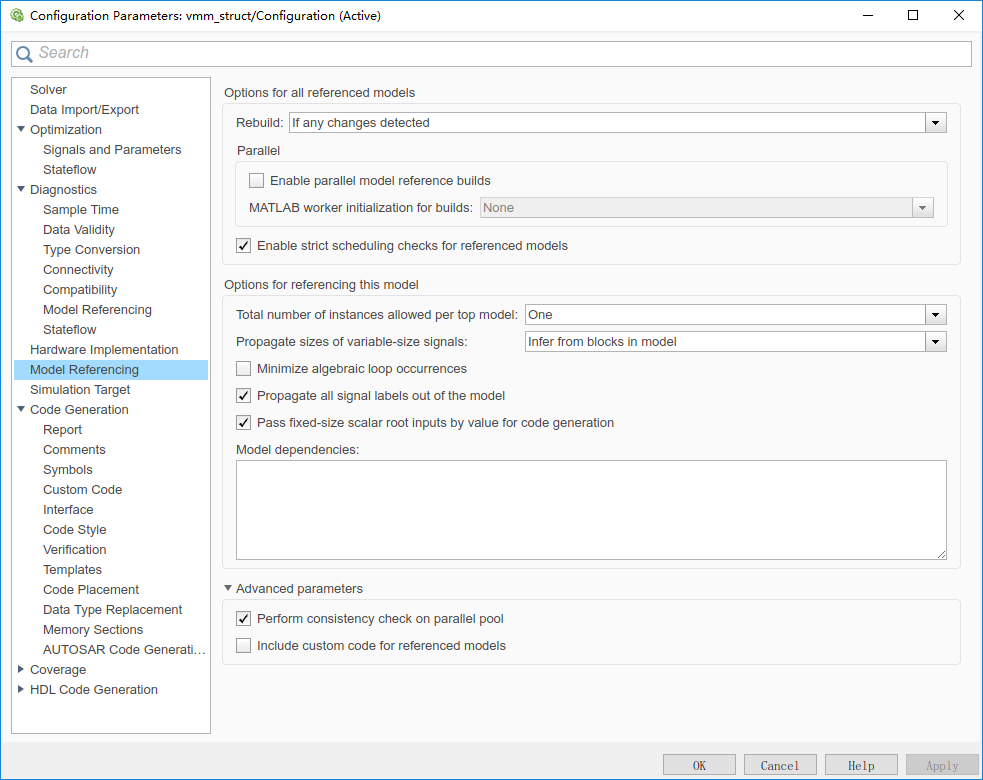

1. Rebuild: 重建的方法，选择 `If any changes detected` 。(参考解释[Rebuild][Rebuild]，参考规则[hisl_0037][hisl_0037])
2. Enable parallel model reference builds: 允许并行模型引用构建，按照默认设置 `不启用` 。(参考解释[Enable parallel model reference builds][Enable parallel model reference builds])
3. MATLAB worker initialization for builds: 并行编译初始化，按照默认设为 `none` 。(参考解释[MATLAB worker initialization for builds][MATLAB worker initialization for builds])
4. Enable strict scheduling checks for referenced export-function models: 引用导出函数的模型进行严格调度检查，此处按照默认 `启用` 。(参考解释[Enable strict scheduling checks][Enable strict scheduling checks])
5. Total number of instances allowed per top model: 在另一个模型中可以发生多少对此模型的引用，按照默认设置为 `Multiple` 。(参考解释[Total number of instances allowed per top model][Total number of instances allowed per top model])
6. Propagate sizes of variable-size signals: 可变大小的信号传播，默认选择 `Infer from blocks in model` 。(参考解释[Propagate sizes of variable-size signals][Propagate sizes of variable-size signals])
7. Minimize algebraic loop occurrences: 允许最小代数环发生，此处 `不启用` 。(参考解释[Minimize algebraic loop occurrences][Minimize algebraic loop occurrences]，参考规则[hisl_0037][hisl_0037])
8. Propagate all signal labels out of the model: 所有信号标签传出模型，按照默认 `启用` 。(参考解释[Propagate all signal labels out of the model][Propagate all signal labels out of the model])
9. Pass fixed-size scalar root inputs by value for code generation: 引用此模型的模型 是否通过值 将其标量输入 传递给该模型，此项 `启用`，使用值作为输入值的 入口传参，需要注意，本条设置在hisl规则中建议不启用，具体可参考规则，下图是代码生成的对比。(参考解释[Pass fixed-size scalar][Pass fixed-size scalar]，参考规则[hisl_0037][hisl_0037])

# 7. Simulation Target 仿真目标设定

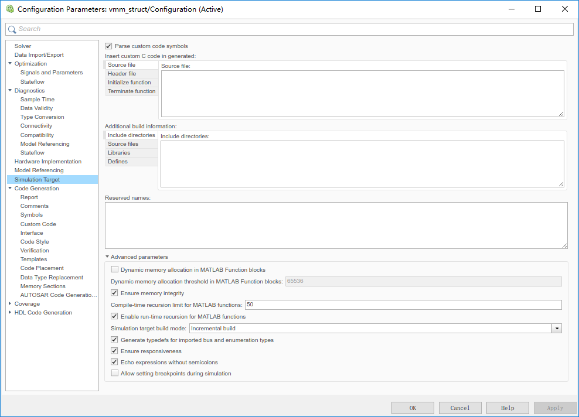

- Parse custom code symbols: 解析自定义代码符号，此项根据实际需要，如果模型有引用C源文件里的变量或函数，需要启用此项，本示例为 `不启用` 。(参考解释[Parse custom code symbols][Parse custom code symbols])

# 8. Code Generation 代码生成设定

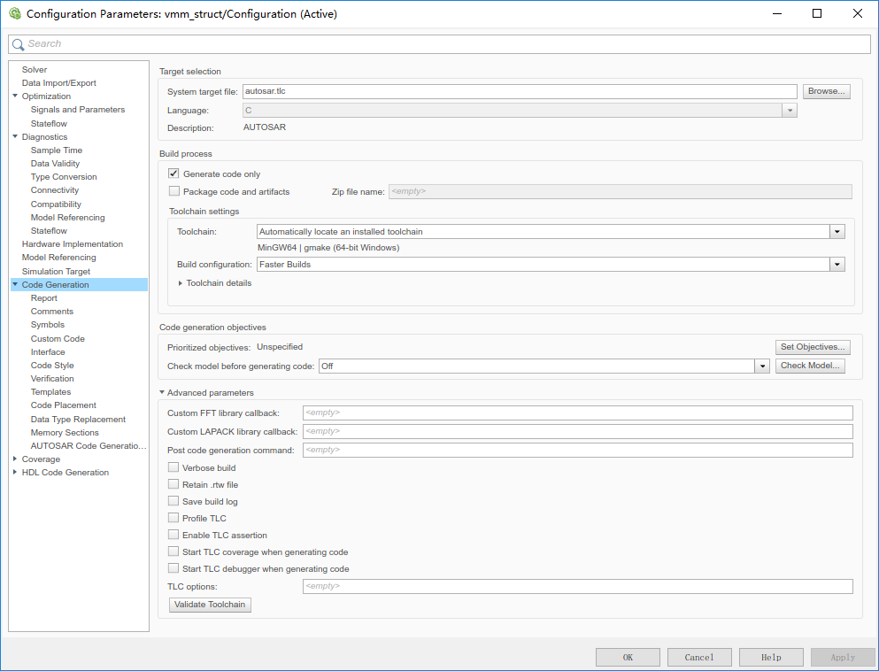

1. System target file: 系统目标文件，选择 `autosar.tlc` 。(参考解释[System target file][System target file])
2. Language: 模型生成的代码语言，此处默认 `c`。(参考解释[Language][Language])
3. Generate code only: 只生成C代码，不进行编译，此处默认 `启用` ，如果不勾选会一块生成makefile并进行可执行文件的编译。(参考解释[Generate code only][Generate code only])
4. Package code and artifacts: 打包生成的代码和组件，默认 `不启用` 。(参考解释[Package code and artifacts][Package code and artifacts])
5. Toolchain: 编译用的工具链，按照默认选择 `Automatically locate an installed toolchain` 。(参考解释[Toolchain][Toolchain])
6. Build configuration: 构建配置，按照默认选择 `Faster Builds` ，目的为不启用编译器优化。(参考解释[Build configuration][Build configuration])
7. Prioritized objectives: 生成代码的优先目标，按照默认设置 `Unspecified` ，若此处进行了设置 例如设置了ROM Efficiency，则仅在生成代码的开头注释部分增加相应的描述，并不会对实际生成的代码产生影响。(参考解释[Prioritized objectives][Prioritized objectives])
8. Check model before generating code: 生成代码前检查模型，选择 `proceed with warnings` ，显示警告信息。(参考解释[Check model before generating code][Check model before generating code])

## 8.1. Code Generation->Report 代码生成报告设定

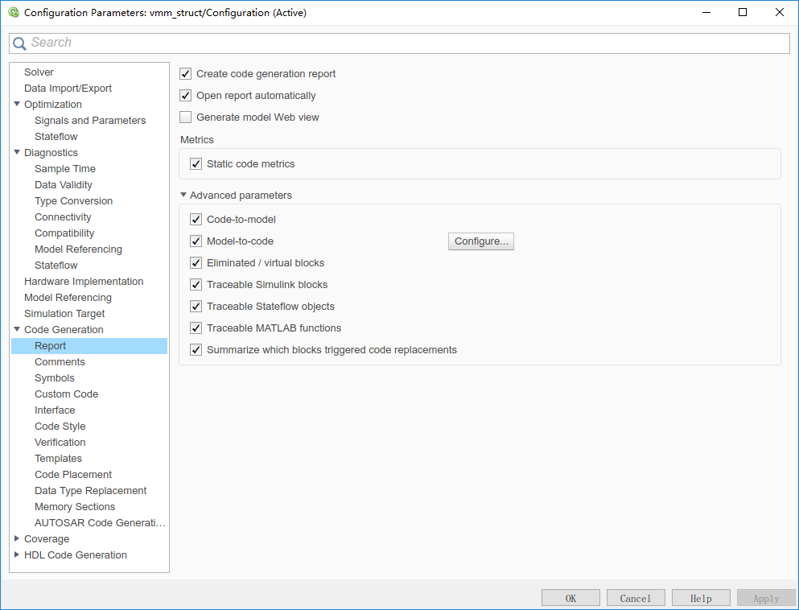

1. Create code generation report: 创建代码生成报告，选择 `启用`。(参考解释[Create code generation report][Create code generation report])
2. Open report automatically: 自动打开生成的报告，选择 `启用`。(参考解释[Open report automatically][Open report automatically])
3. Generate model Web view: 生成模型web视图，默认 `不启用` 。(参考解释[Generate model Web view][Generate model Web view])
4. Static code metrics: 代码生成报告中包含静态代码，选择 `启用` 。(参考解释[Static code metrics][Static code metrics])

## 8.2. Code Generation->Comments 代码生成注释设定

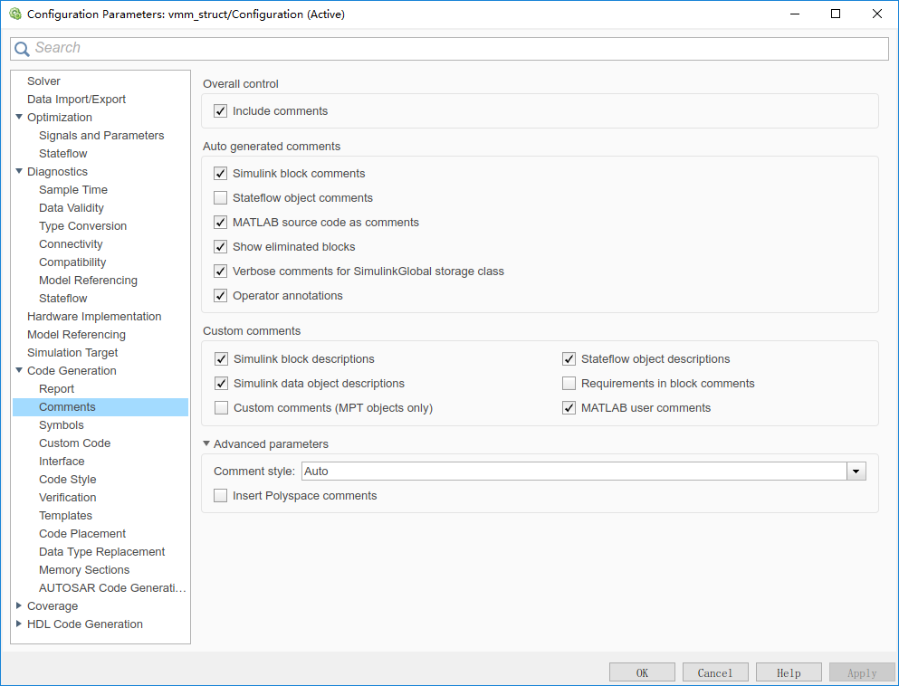

1. Include comments: 生成代码包含注释，选择 `启用` 。(参考规则[hisl_0038][hisl_0038])
2. Simulink block / Stateflow object comments: 插入自动生成的描述模块代码的注释，注释在生成的文件中的代码之前，选择 `启用` 。(参考规则[hisl_0038][hisl_0038])
3. MATLAB source code as comments: 在生成的代码中插入MATLAB源代码作为注释，注释在相关的生成代码之前，此处按照默认选择 `启用` 。(参考解释[MATLAB source code as comments][MATLAB source code as comments])
4. Show eliminated blocks: 在优化结果（例如参数内联）中，删除的代码进行注释显示，选择 `启用` 。(参考解释[Show eliminated blocks][Show eliminated blocks]，参考规则[hisl_0038][hisl_0038])
5. Verbose comments for SimulinkGlobal storage class: 生成SimulinkGlobal储存类的注释，选择 `启用` 。(参考解释[Verbose comments for SimulinkGlobal storage class][Verbose comments for SimulinkGlobal storage class]，参考规则[hisl_0038][hisl_0038])
6. Operator annotations: 在生成的代码中包括操作符注释，按照默认 `启用` 。(参考解释[Operator annotations][Operator annotations])
7. Simulink block descriptions: 生成代码中插入Simulink模块 Description 栏目中描述的注释，按照默认 `启用` 。(参考解释[Simulink block descriptions][Simulink block descriptions])
8. Stateflow object descriptions: 生成代码中插入Stateflow模块 Description 栏目中描述的注释，按照默认 `启用` 。(参考解释[Stateflow object descriptions][Stateflow object descriptions])
9. Simulink data object descriptions: 生成代码中插入Simulink数据对象 Description 栏目中描述的注释，按照默认 `启用` 。(参考解释[Simulink data object descriptions][Simulink data object descriptions])
10. Requirements in block comments: 在生成代码中插入模块链接的需求，根据会议评审此项选择 `不启用` ，需要注意hisl_0038规则推荐为“启用”。(参考解释[Requirements in block comments][Requirements in block comments]，参考规则[hisl_0038][hisl_0038])
11. Custom comments (MPT objects only): 针对模块打包工具MPT的自定义注释，按照默认 `不启用` 。(参考解释[Custom comments (MPT objects only)][Custom comments (MPT objects only)])
12. MATLAB function help text: 对于MATLAB函数进行帮助文档注释，按照默认 `启用` 。(参考解释[MATLAB function help text][MATLAB function help text])

## 8.3. Code Generation->Symbols 代码生成符号标记设定

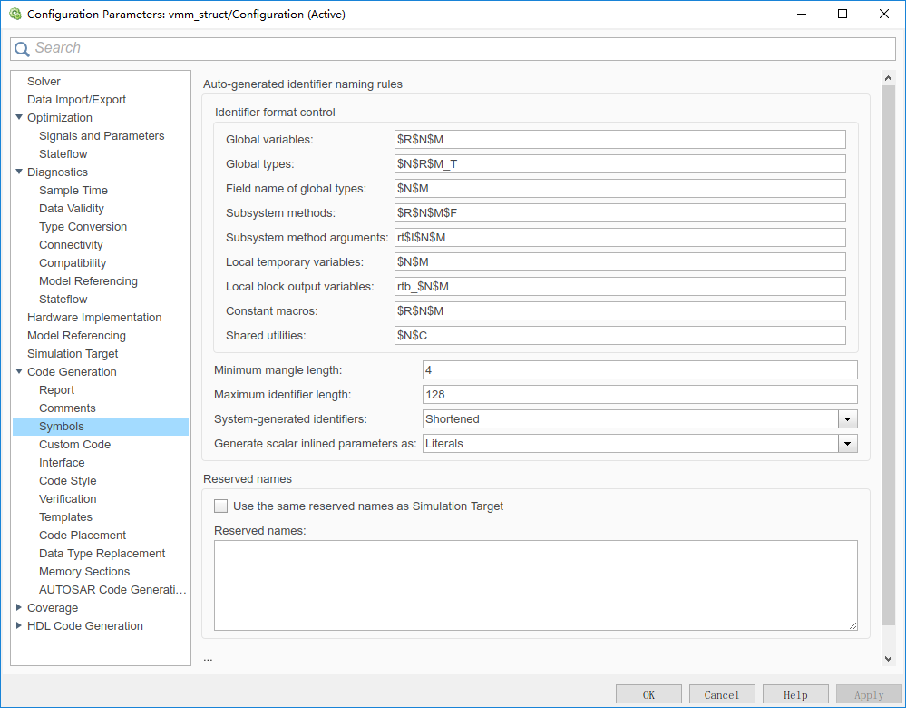

1. Global variables: 自定义生成的全局变量标识符，按照默认填写 `$R$N$M` ，代表的意义可参考本条的链接，需要注意，如果大型项目全局变量过多，有可能发生不同模块中有重名的现象，此时需要自定义此项来避免重命名。(参考说明[Global variables][Global variables])
2. Global types: 自定义生成的全局类型表示符，按照默认填写 `$N$R$M_T` 。(参考说明[Global types][Global types])
3. Field name of global types: 自定义全局类型的字段名称，按照默认填写 `$N$M` 。(参考解释[Field name of global types][Field name of global types])
4. Subsystem methods: 为可重用的子系统生成自定义的函数名，按照默认填写 `$R$N$M$F` 。(参考解释[Subsystem methods][Subsystem methods])
5. Subsystem method arguments: 可重用的子系统生成函数参数名进行自定义，按照默认填写 `rt$I$N$M` 。(参考解释[Subsystem method arguments][Subsystem method arguments])
6. Local temporary variables: 本地临时变量名称自定义，按照默认填写 `$N$M` 。(参考解释[Local temporary variables][Local temporary variables])
7. Local block output variables: 本地模块输出变量名称自定义，按照默认填写 `rtb_$N$M` 。(参考解释[Local block output variables][Local block output variables])
8. Constant macros: 常量宏名称的自定义，按照默认填写 `$R$N$M` 。(参考解释[Constant macros][Constant macros])
9. Shared utilities: 共享应用程序名称自定义，按照默认填写 `$N$C` 。(参考解释[Shared utilities][Shared utilities])
10. Minimum mangle length: 生成名称的最小字符数，设为 `4` 。(参考解释[Minimum mangle length][Minimum mangle length]，参考规则[hisl_0049][hisl_0049])
11. Maximum identifier length: 生成名称的最大字符数，按照默认设为 `31`。(参考解释[Maximum identifier length][Maximum identifier length])
12. System-generated identifiers: 指定代码生成器对于$N的解释是生成较短名称还是正常的名称，选择 `Shortened`。(参考解释[System-generated identifiers][System-generated identifiers]，参考规则[hisl_0060][hisl_0060])
13. Generate scalar inlined parameters as: 控制 在生成代码中标量的内联参数值形式，按照默认选择 `Literals` ，目的为生成标量内联参数作为数字常量。(参考解释[Generate scalar inlined parameters as][Generate scalar inlined parameters as])
14. Signal naming: 在生成的代码中指定信号命名的规则，按照默认选择 `None` ，目的为不更改模型内信号名称，直接进行命名。(参考解释[Signal naming][Signal naming])
15. Parameter naming: 指定生成代码中的命名参数的规则，按照默认选择 `None` 。(参考解释[Parameter naming][Parameter naming])
16. #define naming: 生成代码中#define宏定义的命名规则，按照默认选择 `None` 。(参考解释[#define naming][#define naming])
17. Use the same reserved names as Simulation Target: 使用与 “Simulation Target” 中指定的名称相同的保留名称，按照默认 `不启用` 。(参考解释[Use the same reserved names as Simulation Target][Use the same reserved names as Simulation Target])
18. Reserved names: 保留命名，在输入框中填入需要保留的名称，则在代码生成时不会生成框中填入的名称，此处根据实际需求进行填写，本示例并无此需求，所以不填写。(参考解释[Reserved names][Reserved names])

## 8.4. Code Generation->Custom Code 自定义代码设定

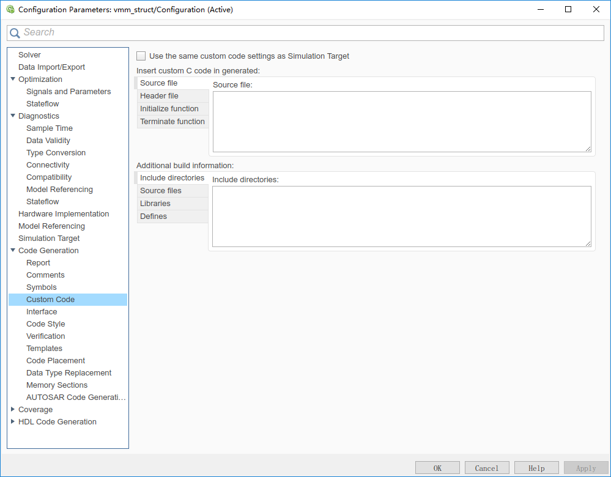

- Use the same custom code settings as Simulation Target: 使用和Simulation Target中设置一样的自定义代码段，如果有自定义部分，此处可以启用，本示例 `不启用` 。(参考解释[Use the same custom code settings][Use the same custom code settings])

## 8.5. Code Generation->Interface 代码接口设定

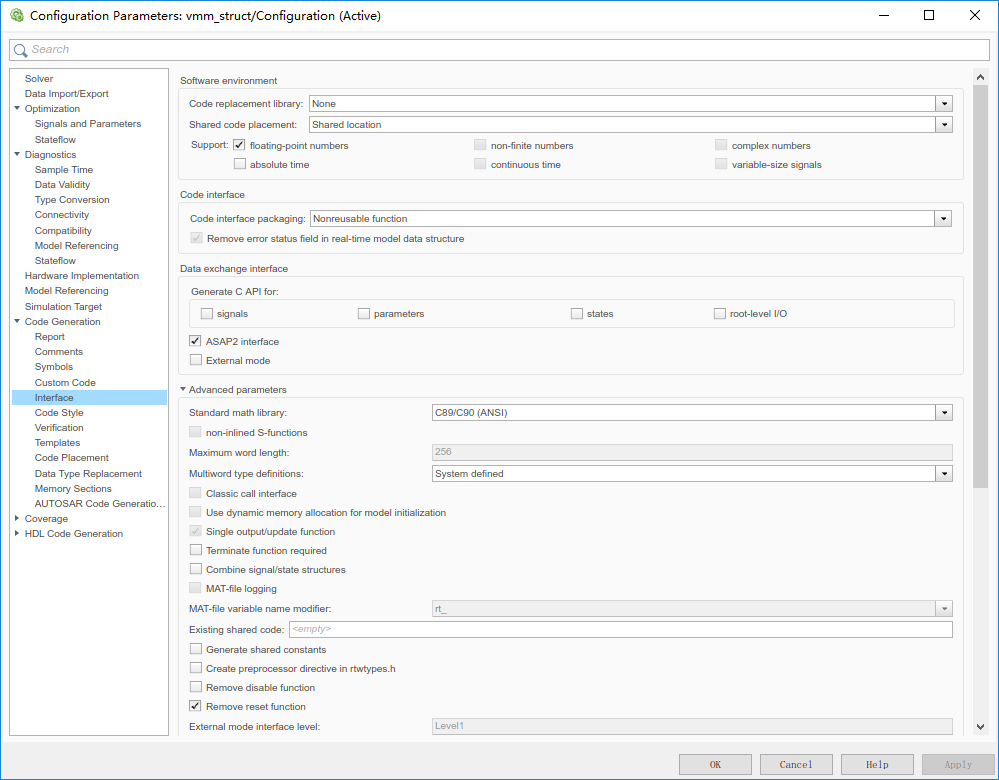

1. Code replacement library: 指定代码生成器在为模型生成代码时使用的代码替换库，按照默认选择为 `none` 。(参考解释[Code replacement library][Code replacement library]，参考规则[hisl_0060][hisl_0060])
2. Shared code placement: 指定生成的通用函数、数据类型定义以及自定义的数据储存类型文件(rtwtypes.h)存放位置，选择 `Shared location` ，目的为最后放在slprj文件夹中。(参考解释[Shared code placement][Shared code placement]，参考规则[hisl_0060][hisl_0060])
3. Support->floating-point numbers: 是否生成浮点类型的数据和相关操作，根据实际项目需求进行选择，此处选为 `启用` 。(参考解释[Support: floating-point numbers][Support: floating-point numbers])
4. Support->non-finite numbers: 是否生成非有限数据（例如NaN和Inf）和相关操作，选择 `不启用` 。(参考解释[Support: non-finite numbers][Support->non-finite numbers]，参考规则[hisl_0039][hisl_0039])
5. Support->complex numbers: 是否生成复数和相关操作，根据实际需求，本示例为Autosar代码生成配置，系统默认不让启用复数定义和操作，此处选择 `不启用` 。(参考解释[Support: complex numbers][Support: complex numbers]，参考规则[hisl_0060][hisl_0060])
6. Support->absolute time: 对于包含使用事件模块的模型，指定其是否为绝对和已用时间 生成整数计数器进行维护，此处选择 `不启用` 。(参考解释[Support->absolute time][Support->absolute time]，参考规则[hisl_0039][hisl_0039])
7. Support->continuous time: 是否为使用连续时间的模块生成代码，此处选择 `不启用` 。(参考解释[Support->continuous time][Support->continuous time]，参考规则[hisl_0039][hisl_0039])
8. Support->variable-size signals: 是否为使用可变大小信号的模型生成代码，此处选择 `不启用` 。(参考解释[Support->variable-size signals][Support->variable-size signals]，参考规则[hisl_0039][hisl_0039])
9. Code interface packaging: 选择生成的接口代码封装模式，按照默认选择 `Nonreusable function` ，目的为生成不可重用的代码，使用静态分配进行地址和访问入口设定。(参考解释[Code interface packaging][Code interface packaging])
10. Remove error status field in real-time model data structure: 是否从生成的实时模型数据结构中省略系统错误状态字(rtModel)，选择 `启用` ，省略系统状态错误字的传递可减少内存使用。(参考解释[Remove error status field in real-time model data structure][Suppress error status in real-time model data]，参考规则[hisl_0039][hisl_0039])
11. Generate C API for-> signals: 在代码中生成信号变量的数据交换的接口，此处按照默认设置 `不启用`。(参考解释[Generate C API for-> signals][Generate C API for-> signals])
12. Generate C API for-> parameters: 在代码中生成parameters变量的数据交换的接口，此处按照默认设置 `不启用`。(参考解释[Generate C API for-> parameters][Generate C API for-> parameters])
13. Generate C API for-> states: 在代码中生成states变量的数据交换的接口，此处按照默认设置 `不启用`。(参考解释[Generate C API for-> states][Generate C API for-> states])
14. Generate C API for-> root-level I/O: 在代码中生成root-level I/O变量的数据交换的接口，此处按照默认设置 `不启用`。(参考解释[Generate C API for-> root-level I/O][Generate C API for-> root-level I/O])
15. ASAP2 interface: 生成ASAP2的数据接口，此处设为`启用`。(参考解释[ASAP2 interface][ASAP2 interface])
16. External mode: 生成外部模型用到的数据交换接口，按照默认设为`不启用`。(参考解释[External mode][External mode])

## 8.6. Code Generation->Code Style 代码生成风格设定

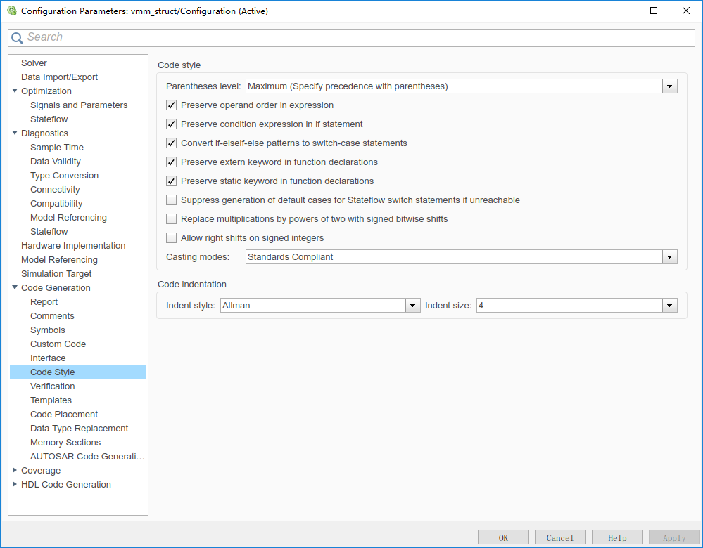

1. Parentheses level: 为生成的代码指定圆括号样式，选择 `Maximum (Specify precedence with parentheses)` ，尽可能的使用括号来说明运算优先级，目的为满足MISRA-C。 (参考解释[Parentheses level][Parentheses level] ，参考规则[hisl_0047][hisl_0047])
2. Preserve operand order in expression: 指定是否保留表达式中操作数的顺序，选择 `启用` 。(参考解释[Preserve operand order in expression][Preserve operand order in expression]，参考规则[hisl_0047][hisl_0047])
3. Preserve condition expression in if statement: 指定是否在if语句中保留 空的 主条件表达式，选择 `启用` 。(参考解释[Preserve condition expression in if statement][Preserve condition expression in if statement]，参考规则[hisl_0047][hisl_0047])
4. Convert if-elseif-else patterns to switch-case statements: 对于特定if-elseif-else结构转换为switch-case结构，此处选择 `启用` ,目的为节省ROM和增加执行效率。(参考解释[Convert if-elseif-else patterns to switch-case statements][Convert if-elseif-else patterns to switch-case statements])
5. Preserve extern keyword in function declarations: 是否使用关键字extern对函数进行声明，此处按照默认设置 `开启` ，使用extern进行对函数外部链接和调用的声明。(参考解释[Preserve extern keyword in function declarations][Preserve extern keyword in function declarations])
6. Suppress generation of default cases for Stateflow switch statements if unreachable: 对于stateflow中生成的switch-case结构是否抑制生成default分支，选择 `不启用` ，目的为生成default分支，满足MISRA-C的规范要求。(参考解释[Suppress generation of default cases for Stateflow switch statements if unreachable][Suppress generation of default cases for Stateflow switch statements if unreachable])
7. Replace multiplications by powers of two with signed bitwise shifts: 是否使用位移对有符号的数特定乘法进行替代优化，选择 `不启用` ，目的为满足MISRA-C规范要求。(参考解释[Replace multiplications by powers of two with signed bitwise shifts][Replace multiplications by powers of two with signed bitwise shifts]，参考规则[hisl_0060][hisl_0060])
8. Allow right shifts on signed integers: 是否允许有符号整数右移操作，选择 `不启用` ，不允许有符号数右移，满足MISRA-C规则。(参考解释[Allow right shifts on signed integers][Allow right shifts on signed integers])
9. Casting modes: 强制转换模式，选择 `Standards Compliant` ，生成符合MISRA-C规范的强制转换。(参考解释[Casting modes][Casting modes]，参考规则[hisl_0060][hisl_0060])
10. Indent style: 缩进风格，选择 `Allman` 。(参考解释[Indent style][Indent style])
11. Indent size: 缩进大小，填写 `4` 。(参考解释[Indent size][Indent size])

## 8.7. Code Generation->Verification 代码验证设定

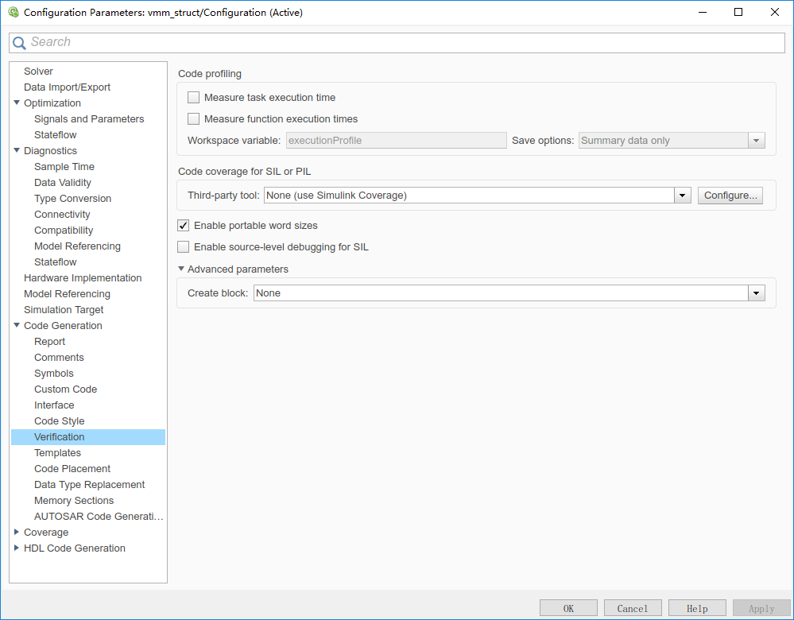

1. Measure task execution time: 在SIL和PIL模拟期间，测量任务执行时间，在代码调试阶段可以启用，生成产品级代码时不能启用，本示例选择 `不启用` 。(参考解释[Measure task execution time][Measure task execution time])
2. Measure function execution times: 在SIL和PIL模拟期间，测量函数执行时间，在代码调试阶段可以启用，生成产品级代码时不能启用，本示例选择 `不启用` 。(参考解释[Measure function execution times][Measure function execution times])
3. Workspace variable: 代码运行时间测量所需要的工作空间变量，如果启用代码时间测量则此处启用。(参考解释[Workspace variable][Workspace variable])
4. Save options: 是否将代码测量和分析的数据保存到工作区，如果启用代码时间测量则此处启用。(参考解释[Save options][Save options])
5. Code coverage tool: 指定一个第三方代码覆盖度检测工具，2016a版本支持BullseyeCoverage和LDRA Testbed两款工具进行嵌入审查，本示例选择 `None` 。(参考解释[Code coverage tool][Code coverage tool])
6. Enable portable word sizes: 是否使用宏定义基础变量大小的方式，针对跨平台设计生成可移植的代码，此处选择 `启用` 。(参考解释[Enable portable word sizes][Enable portable word sizes])
7. Enable source-level debugging for SIL: 是否允许在SIL模拟期间 调试生成的源代码 ，此处 `不启用` ，目的为生成效率高的代码。(参考解释[Enable source-level debugging for SIL][Enable source-level debugging for SIL])

## 8.8. Code Generation->Templates 生成代码模板设定

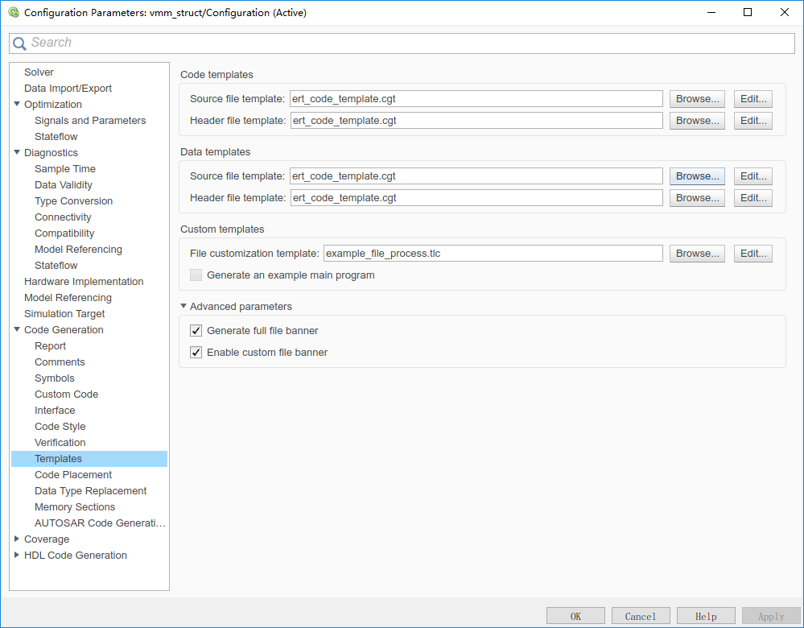

- 代码生成模板文件，本示例默认按照matlab自带模板进行代码生成，如需更改模板，可参考如下链接:[Generate Custom File and Function Banners][Generate Custom File and Function Banners]，[Code Generation Template (CGT) Files][Code Generation Template (CGT) Files]

## 8.9. Code Generation->Code Placement 代码放置位置设定

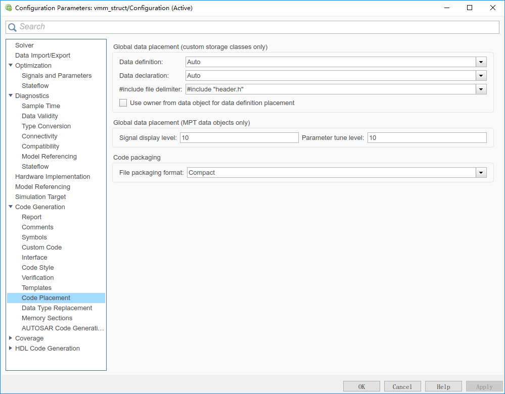

1. Data definition: 全局变量定义的位置，按照默认选择 `Auto` 。(参考解释[Data definition][Data definition])
2. Data declaration: 全局变量声明(extern, typedef, #define)的位置，按照默认选择 `Auto` 。(参考解释[Data declaration][Data declaration])
3. #include file delimiter: 指定#include在生成的代码中使用的文件分隔符的类型，选择 `#include "header.h"`，目的为对于代码编译和链接的可控，要求所有参与编译的文件都要放到该工程文件夹中。(参考解释[#include file delimiter][#include file delimiter])
4. Use owner from data object for data definition placement: 指定是否使用自定义的数据对象来替换生成代码中的数据声明，此处选择 `不启用`，目的为使用自动代码生成。(参考解释[Use owner from data object for data definition placement][Use owner from data object for data definition placement])
5. Signal display level: 指定MPT信号数据的持久性级别，和信号的 显示级别(Signal display level)进行比较对应，如果数值小于显示级别，则最后信号数据将以自定义的属性进行代码生成，否则会根据自动生成器进行确认和代码生成，此处按照默认填写 `10` 。(参考解释[Signal display level][Signal display level])
6. Parameter tune level: 指定可调参数的持久性级别，此处按照默认填写 `10` 。(参考解释[Parameter tune level][Parameter tune level])
7. File packaging format: 生成文件包格式，此项选择`Compact`，如果选择 “Compact (with separate data file)” 则会将所生成的代码主要放到model_data.c、model.c、model.h 这三个文件中，生成的文件意义可参考[Generated Code Modules][Generated Code Modules]。(参考解释[File packaging format][File packaging format])

## 8.10. Code Generation->Data Type Replacement 生成代码数据类型替换设定

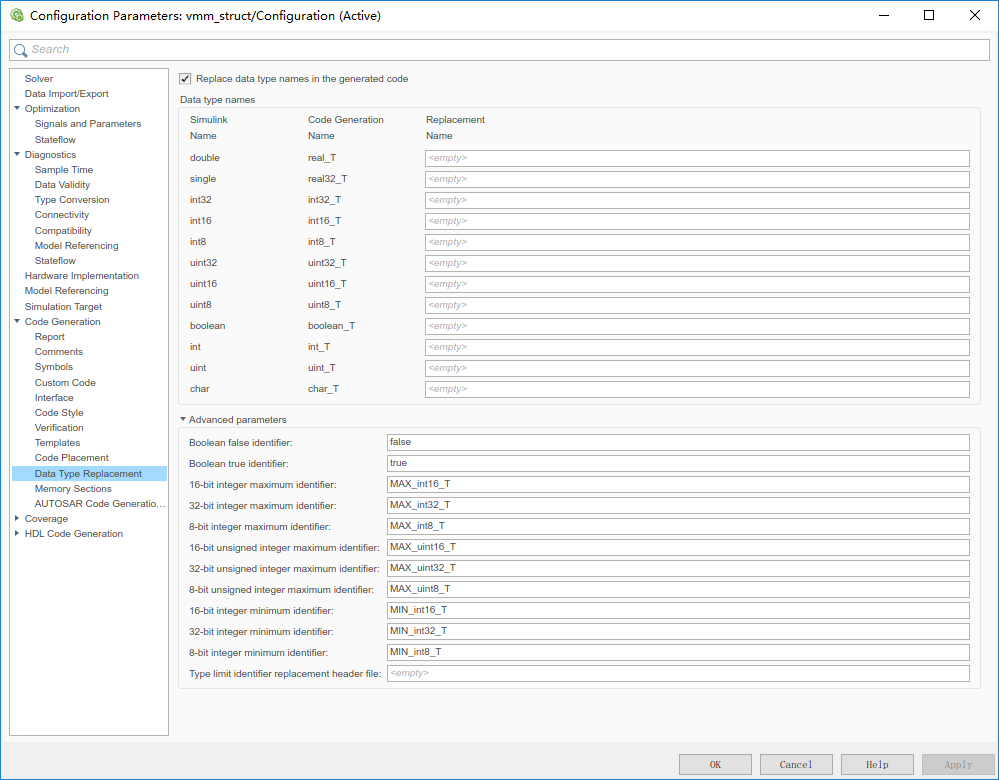

- Replace data type names in the generated code: 指定是否使用 用户自定义的数据类型进行 代码自动生成 的数据类型替换，选择 `不启用` 。(参考解释[Replace data type names in the generated code][Replace data type names in the generated code])

## 8.11. Code Generation->Memory Sections 生成代码内存块设定

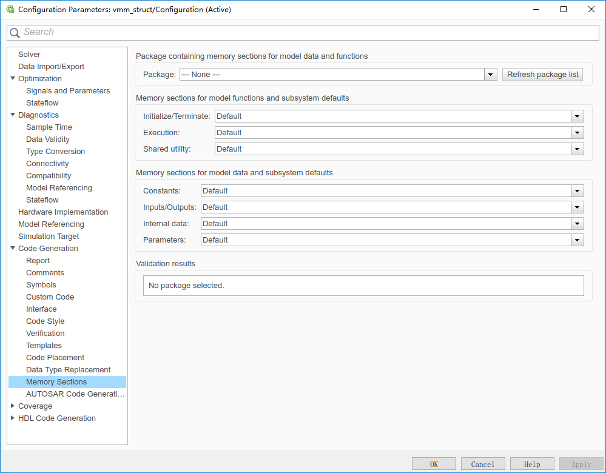

- Package: 指定一段分配的内存进行模型函数和数据的打包，选择 `None` 。(参考解释[Package][Package])
- 本页面其它选项选为 `Default` ，目的为不使用特殊的内存分配方式对各个模块生成出来的代码进行安置，如果需要在此处进行内存配，请参考[Control Data and Function Placement in Memory by Inserting Pragmas][Control Data and Function Placement in Memory by Inserting Pragmas]。 

## 8.12. Code Generation->AUTOSAR Code Generation Options 生成适配AUTOSAR代码的配置选项

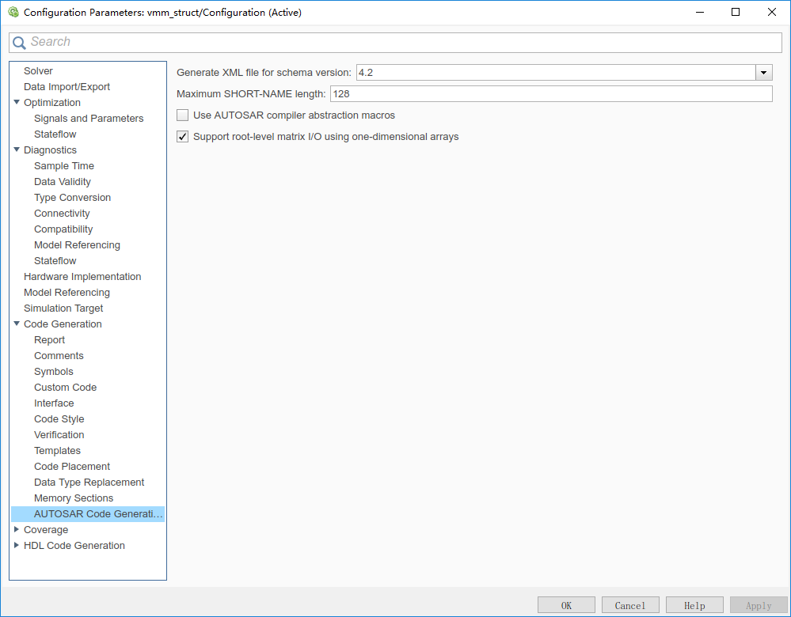

1. Generate XML file for schema version: 生成XML文件对应的AUTOSAR适配版本，根据实际需求进行选择，本示例选择 `4.2` 。(参考解释[Generate XML file for schema version][Generate XML file for schema version])
2. Maximum SHORT-NAME length: 指定缩写名称最大长度，根据会议评审，填写 `64`。(参考解释[Maximum SHORT-NAME length][Maximum SHORT-NAME length])
3. Use AUTOSAR compiler abstraction macros: 使用AUTOSAR定义的宏进行编译，选择 `不启用` 。(参考解释[Use AUTOSAR compiler abstraction macros][Use AUTOSAR compiler abstraction macros])
4. Support root-level matrix I/O using one-dimensional arrays: 是否支持根层级的矩阵 I/O ，选择 `不启用`。(参考解释[Support root-level matrix I/O using one-dimensional arrays][Support root-level matrix I/O using one-dimensional arrays])

-------------------------------------------------

[hisl_0040]: http://cn.mathworks.com/help/simulink/mdl_gd/hi/solver.html#br8g5r3-1
[hisl_0041]: http://cn.mathworks.com/help/simulink/mdl_gd/hi/solver.html#bspifwl-1
[hisl_0042]:http://cn.mathworks.com/help/simulink/mdl_gd/hi/solver.html#bspif3y-1
[Periodic sample time constraint]:http://cn.mathworks.com/help/simulink/gui/periodic-sample-time-constraint.html
[Automatically handle rate transition for data transfer]:http://cn.mathworks.com/help/simulink/gui/automatically-handle-rate-transition-for-data-transfer.html
[Higher priority value indicates higher task priority]:http://cn.mathworks.com/help/simulink/gui/higher-priority-value-indicates-higher-task-priority.html
[Input]:https://cn.mathworks.com/help/simulink/gui/input.html
[Initial state]:https://cn.mathworks.com/help/simulink/gui/initial-state.html
[Time]:https://cn.mathworks.com/help/simulink/gui/time.html
[States]:
https://cn.mathworks.com/help/simulink/gui/states.html
[Format]:https://cn.mathworks.com/help/simulink/gui/format.html
[Output]:https://cn.mathworks.com/help/simulink/gui/output.html
[Final states]:https://cn.mathworks.com/help/simulink/gui/final-states.html
[Signal logging]:https://cn.mathworks.com/help/simulink/gui/signal-logging.html
[Data stores]:https://cn.mathworks.com/help/simulink/gui/data-stores.html
[Log dataset data to file]:https://cn.mathworks.com/help/simulink/gui/log-dataset-data-to-file.html
[Singal simulation output]:https://cn.mathworks.com/help/simulink/gui/single-simulation-output.html
[Record logged workspace data in Simulation Data Inspector]:https://cn.mathworks.com/help/simulink/gui/record-logged-workspace-data-in-simulation-data-inspector.html
[Write streamed signals to workspace]:https://cn.mathworks.com/help/simulink/gui/write-streamed-signals-to-workspace.html
[Limit data points]:https://cn.mathworks.com/help/simulink/gui/limit-data-points.html
[Default for underspecified data type]:https://cn.mathworks.com/help/simulink/gui/default-for-underspecified-data-type.html
[Use division for fixed-point net slope computation]:https://cn.mathworks.com/help/simulink/gui/use-division-for-fixed-point-net-slope-computation.html
[Use floating-point multiplication to handle net slope corrections]:https://cn.mathworks.com/help/simulink/gui/use-floating-point-multiplication-to-handle-net-slope-corrections.html
[Application lifespan]:https://cn.mathworks.com/help/simulink/gui/application-lifespan-days.html
[hisl_0048]:https://cn.mathworks.com/help/simulink/mdl_gd/hi/optimizations.html?searchHighlight=hisl_0048%3A%20Configuration%20Parameters&s_tid=doc_srchtitle#br8hiaw-1
[Optimize using the specified minimum and maximum values]: https://cn.mathworks.com/help/simulink/gui/optimize-using-the-specified-minimum-and-maximum-values.html
[Remove root level I/O zero initialization]:https://cn.mathworks.com/help/simulink/gui/remove-root-level-io-zero-initialization.html
[Remove internal data zero initialization]:https://cn.mathworks.com/help/simulink/gui/remove-internal-data-zero-initialization.html
[hisl_0052]:https://cn.mathworks.com/help/simulink/mdl_gd/hi/optimizations.html#bspjo6j-1
[Remove code from floating-point]:http://cn.mathworks.com/help/simulink/gui/remove-code-from-floating-point-to-integer-conversions-that-wraps-out-of-range-values.html
[hisl_0053]:http://cn.mathworks.com/help/simulink/mdl_gd/hi/optimizations.html#bspjpib-1
[Remove code that protects]:http://cn.mathworks.com/help/simulink/gui/remove-code-that-protects-against-division-arithmetic-exceptions.html
[hisl_0054]:http://cn.mathworks.com/help/simulink/mdl_gd/hi/optimizations.html#bspjpt7-1
[Default parameter behavior]:http://cn.mathworks.com/help/simulink/gui/default-parameter-behavior.html
[Inline invariant signals]:http://cn.mathworks.com/help/simulink/gui/inline-invariant-signals.html
[Use memcpy for vector assignment]:http://cn.mathworks.com/help/simulink/gui/use-memcpy-for-vector-assignment.html
[Memcpy threshold]:http://cn.mathworks.com/help/simulink/gui/memcpy-threshold-bytes.html
[Loop unrolling threshold]:http://cn.mathworks.com/help/simulink/gui/loop-unrolling-threshold.html
[hisl_0051]:http://cn.mathworks.com/help/simulink/mdl_gd/hi/optimizations.html#bspjoso-1
[Pack Boolean data into bitfields]:http://cn.mathworks.com/help/simulink/gui/pack-boolean-data-into-bitfields.html
[Maximum stack size]:http://cn.mathworks.com/help/simulink/gui/maximum-stack-size-bytes.html
[Pass reusable subsystem outputs as]:http://cn.mathworks.com/help/simulink/gui/pass-reusable-subsystem-outputs-as.html
[Parameter structure]:http://cn.mathworks.com/help/simulink/gui/parameter-structure.html
[ Use bitsets for storing]: http://cn.mathworks.com/help/simulink/gui/use-bitsets-for-storing-state-configuration.html
[Use bitsets for storing Boolean data]:http://cn.mathworks.com/help/simulink/gui/use-bitsets-for-storing-boolean-data.html
[Base storage type for automatically created enumerations]:http://cn.mathworks.com/help/simulink/gui/base-storage-type-for-automatically-created-enumerations.html
[Algebraic loop]:http://cn.mathworks.com/help/simulink/gui/algebraic-loop.html
[hisl_0043]:http://cn.mathworks.com/help/simulink/mdl_gd/hi/diagnostics.html#bspigao-1
[Minimize algebraic loop]:http://cn.mathworks.com/help/simulink/gui/minimize-algebraic-loop.html
[Block priority violation]:http://cn.mathworks.com/help/simulink/gui/block-priority-violation.html
[Min step size violation]:http://cn.mathworks.com/help/simulink/gui/min-step-size-violation.html
[Consecutive zero-crossings violation]:http://cn.mathworks.com/help/simulink/gui/consecutive-zero-crossings-violation.html
[Automatic solver parameter selection]:http://cn.mathworks.com/help/simulink/gui/automatic-solver-parameter-selection.html
[Extraneous discrete derivative signals]:http://cn.mathworks.com/help/simulink/gui/extraneous-discrete-derivative-signals.html
[State name clash]:http://cn.mathworks.com/help/simulink/gui/state-name-clash.html
[SimState interface checksum mismatch]:http://cn.mathworks.com/help/simulink/gui/simstate-interface-checksum-mismatch.html
[Source block specifies -1 sample time]:http://cn.mathworks.com/help/simulink/gui/source-block-specifies-1-sample-time.html
[hisl_0044]:http://cn.mathworks.com/help/simulink/mdl_gd/hi/diagnostics.html#bspihqr-1
[Multitask rate transition]:http://cn.mathworks.com/help/simulink/gui/multitask-rate-transition.html
[Single task rate transition]:http://cn.mathworks.com/help/simulink/gui/single-task-rate-transition.html
[Tasks with equal priority]:http://cn.mathworks.com/help/simulink/gui/tasks-with-equal-priority.html
[Enforce sample times specified]:http://cn.mathworks.com/help/simulink/gui/enforce-sample-times-specified-by-signal-specification-blocks.html
[Sample hit time adjusting]:http://cn.mathworks.com/help/simulink/gui/sample-hit-time-adjusting.html
[Unspecified inheritability of sample time]:http://cn.mathworks.com/help/simulink/gui/unspecified-inheritability-of-sample-time.html
[Signal resolution]:http://cn.mathworks.com/help/simulink/gui/signal-resolution.html
[Wrap on overflow]:http://cn.mathworks.com/help/simulink/gui/diagnostics-pane-data-validity.html
[Division by singular matrix]:http://cn.mathworks.com/help/simulink/gui/division-by-singular-matrix.html
[Saturate on overflow]:http://cn.mathworks.com/help/simulink/gui/saturate-on-overflow.html
[Underspecified data types]:http://cn.mathworks.com/help/simulink/gui/underspecified-data-types.html
[Inf or NaN block output]:http://cn.mathworks.com/help/simulink/gui/inf-or-nan-block-output.html
[Simulation range checking]:http://cn.mathworks.com/help/simulink/gui/simulation-range-checking.html
["rt" prefix for identifiers]:http://cn.mathworks.com/help/simulink/gui/rt-prefix-for-identifiers.html
[Detect downcast]:http://cn.mathworks.com/help/simulink/gui/detect-downcast.html
[hisl_0302]:http://cn.mathworks.com/help/simulink/mdl_gd/hi/diagnostics.html#bs5yxvc-1
[Detect overflow]:http://cn.mathworks.com/help/simulink/gui/detect-overflow_bq8t6q3-20.html
[Detect underflow]:http://cn.mathworks.com/help/simulink/gui/detect-underflow_bq8t6q3-22.html
[Detect precision loss]:http://cn.mathworks.com/help/simulink/gui/detect-precision-loss_bq8t6q3-24.html
[Detect loss of tunability]:http://cn.mathworks.com/help/simulink/gui/detect-loss-of-tunability.html
[Detect read before write]:http://cn.mathworks.com/help/simulink/gui/detect-read-before-write.html
[Multitask data store]:http://cn.mathworks.com/help/simulink/gui/multitask-data-store.html
[Detect write after read]:http://cn.mathworks.com/help/simulink/gui/detect-write-after-read.html
[Duplicate data store names]:http://cn.mathworks.com/help/simulink/gui/duplicate-data-store-names.html
[Detect write after write]:http://cn.mathworks.com/help/simulink/gui/detect-write-after-write.html
[Unnecessary type conversions]:http://cn.mathworks.com/help/simulink/gui/unnecessary-type-conversions.html
[Vector/matrix block input conversion]:http://cn.mathworks.com/help/simulink/gui/vectormatrix-block-input-conversion.html
[hisl_0309]:http://cn.mathworks.com/help/simulink/mdl_gd/hi/diagnostics.html#bs5xnkr-1
[32-bit integer to single]:http://cn.mathworks.com/help/simulink/gui/32-bit-integer-to-single-precision-float-conversion.html
[Detect underflow1]:http://cn.mathworks.com/help/simulink/gui/detect-underflow_br5fmss-1.html
[Detect overflow1]:http://cn.mathworks.com/help/simulink/gui/detect-overflow_br72rsf-1.html
[Detect precision loss1]:http://cn.mathworks.com/help/simulink/gui/detect-precision-loss_br5fmu8-1.html
[Signal label mismatch]:https://cn.mathworks.com/help/simulink/gui/signal-label-mismatch.html
[hisl_0306]:http://cn.mathworks.com/help/simulink/mdl_gd/hi/diagnostics.html#bs5xhvb-1
[Unconnected block input ports]:https://cn.mathworks.com/help/simulink/gui/unconnected-block-input-ports.html
[Unconnected block output ports]:https://cn.mathworks.com/help/simulink/gui/unconnected-block-output-ports.html
[Unconnected line]:https://cn.mathworks.com/help/simulink/gui/unconnected-line.html
[Unspecified bus object at root Outport block]:https://cn.mathworks.com/help/simulink/gui/unspecified-bus-object-at-root-outport-block.html
[hisl_0307]:http://cn.mathworks.com/help/simulink/mdl_gd/hi/diagnostics.html#bs5xm4l-1
[Element name mismatch]:https://cn.mathworks.com/help/simulink/gui/element-name-mismatch.html
[Bus signal treated as vector]:https://cn.mathworks.com/help/simulink/gui/bus-signal-treated-as-vector.html
[Non-bus signals treated as bus signals]:https://cn.mathworks.com/help/simulink/gui/non-bus-signals-treated-as-bus-signals.html
[Repair bus selections]:https://cn.mathworks.com/help/simulink/gui/repair-bus-selections.html
[Invalid function-call connection]:https://cn.mathworks.com/help/simulink/gui/invalid-function-call-connection.html
[hisl_0308]:http://cn.mathworks.com/help/simulink/mdl_gd/hi/diagnostics.html#bs5xndb-1
[Context-dependent inputs]:https://cn.mathworks.com/help/simulink/gui/context-dependent-inputs.html
[S-function upgrades needed]:https://cn.mathworks.com/help/simulink/gui/s-function-upgrades-needed.html
[hisl_0301]:http://cn.mathworks.com/help/simulink/mdl_gd/hi/diagnostics.html#bs5xbrw-1
[Block behavior depends]:https://cn.mathworks.com/help/simulink/gui/block-behavior-depends-on-frame-status-of-signal.html
[SimState object from earlier release]:https://cn.mathworks.com/help/simulink/gui/simstate-object-from-earlier-release.html
[Model block version mismatch]:https://cn.mathworks.com/help/simulink/gui/model-block-version-mismatch.html
[hisl_0310]:http://cn.mathworks.com/help/simulink/mdl_gd/hi/diagnostics.html#bs5xnrt-1
[Port and parameter mismatch]:https://cn.mathworks.com/help/simulink/gui/port-and-parameter-mismatch.html
[Invalid root Inport/Outport block connection]:https://cn.mathworks.com/help/simulink/gui/invalid-root-inportoutport-block-connection.html
[Unsupported data logging]:https://cn.mathworks.com/help/simulink/gui/unsupported-data-logging.html
[Unused data, events, messages, and functions]:http://cn.mathworks.com/help/simulink/gui/unused-data-events-and-messages.html
[Unexpected backtracking]:http://cn.mathworks.com/help/simulink/gui/unexpected-backtracking.html
[hisl_0311]:http://cn.mathworks.com/help/simulink/mdl_gd/hi/diagnostics.html#bs5xn2s-1
[Invalid input data access in chart initialization]:http://cn.mathworks.com/help/simulink/gui/invalid-input-data-access-in-chart-initialization.html
[No unconditional default transitions]:http://cn.mathworks.com/help/simulink/gui/no-unconditional-default-transitions.html
[Transition outside natural parent]:http://cn.mathworks.com/help/simulink/gui/transition-outside-natural-parent.html
[Undirected event broadcasts]:http://cn.mathworks.com/help/simulink/gui/undirected-event-broadcasts.html
[Transition action specified before condition action]:http://cn.mathworks.com/help/simulink/gui/transition-action-specified-before-condition-action.html
[Read-before-write to output in Moore chart]:http://cn.mathworks.com/help/simulink/gui/read-before-write-to-output-in-moore-chart.html
[Signed integer division rounds to]:https://cn.mathworks.com/help/simulink/gui/hardware-implementation-pane.html#bq8t7za-59
[Shift right on a signed integer as arithmetic shift]: https://cn.mathworks.com/help/simulink/gui/hardware-implementation-pane.html#bq8t7za-64
[Rebuild]:https://cn.mathworks.com/help/simulink/gui/rebuild.html
[hisl_0037]:http://cn.mathworks.com/help/simulink/mdl_gd/hi/model-referencing.html#bvevvzi
[Enable parallel model reference builds]:https://cn.mathworks.com/help/simulink/gui/enable-parallel-model-reference-builds.html
[MATLAB worker initialization for builds]:https://cn.mathworks.com/help/simulink/gui/matlab-worker-initialization-for-builds.html
[Enable strict scheduling checks]:https://cn.mathworks.com/help/simulink/gui/enable-strict-scheduling-checks-for-referenced-export-function-models.html
[Total number of instances allowed per top model]:https://cn.mathworks.com/help/simulink/gui/total-number-of-instances-allowed-per-top-model.html
[Propagate sizes of variable-size signals]:https://cn.mathworks.com/help/simulink/gui/propagate-sizes-of-variable-size-signals.html
[Minimize algebraic loop occurrences]:https://cn.mathworks.com/help/simulink/gui/minimize-algebraic-loop-occurrences.html
[Propagate all signal labels out of the model]:https://cn.mathworks.com/help/simulink/gui/propagate-all-signal-labels-out-of-the-model.html
[Pass fixed-size scalar]:https://cn.mathworks.com/help/simulink/gui/pass-fixed-size-scalar-root-inputs-by-value-for-code-generation.html
[Parse custom code symbols]: http://cn.mathworks.com/help/simulink/gui/parse-custom-code-symbols.html
[System target file]:http://cn.mathworks.com/help/rtw/ref/system-target-file.html
[Language]:http://cn.mathworks.com/help/rtw/ref/language.html
[Generate code only]:http://cn.mathworks.com/help/rtw/ref/generate-code-only.html
[Package code and artifacts]:https://cn.mathworks.com/help/rtw/ref/package-code-and-artifacts.html
[Toolchain]:https://cn.mathworks.com/help/rtw/ref/toolchain.html
[Build configuration]:https://cn.mathworks.com/help/rtw/ref/build-configuration.html
[Prioritized objectives]:https://cn.mathworks.com/help/rtw/ref/prioritized-objectives.html
[Check model before generating code]:https://cn.mathworks.com/help/rtw/ref/check-model-before-generating-code.html
[Create code generation report]:https://cn.mathworks.com/help/rtw/ref/create-code-generation-report.html
[Open report automatically]:https://cn.mathworks.com/help/rtw/ref/open-report-automatically.html
[Code-to-model]:https://cn.mathworks.com/help/rtw/ref/code-to-model.html
[Model-to-code]:https://cn.mathworks.com/help/rtw/ref/model-to-code.html
[Generate model Web view]:https://cn.mathworks.com/help/rtw/ref/generate-model-web-view.html
[Eliminated / virtual blocks]:https://cn.mathworks.com/help/rtw/ref/eliminated-virtual-blocks.html
[Static code metrics]:https://cn.mathworks.com/help/rtw/ref/static-code-metrics.html
[hisl_0038]:http://cn.mathworks.com/help/simulink/mdl_gd/hi/code-generation.html#bvevv3f
[MATLAB source code as comments]:https://cn.mathworks.com/help/rtw/ref/matlab-source-code-as-comments.html
[Show eliminated blocks]:https://cn.mathworks.com/help/rtw/ref/show-eliminated-blocks.html
[Verbose comments for SimulinkGlobal storage class]:https://cn.mathworks.com/help/rtw/ref/verbose-comments-for-simulink-global-storage-class.html
[Operator annotations]:https://cn.mathworks.com/help/rtw/ref/operator-annotations.html
[Simulink block descriptions]:https://cn.mathworks.com/help/rtw/ref/simulink-block-descriptions.html
[Stateflow object descriptions]:https://cn.mathworks.com/help/rtw/ref/stateflow-object-descriptions.html
[Simulink data object descriptions]:https://cn.mathworks.com/help/rtw/ref/simulink-data-object-descriptions.html
[Requirements in block comments]:https://cn.mathworks.com/help/rtw/ref/requirements-in-block-comments.html
[Custom comments (MPT objects only)]:https://cn.mathworks.com/help/rtw/ref/custom-comments-mpt-objects-only.html
[MATLAB function help text]:https://cn.mathworks.com/help/rtw/ref/matlab-function-help-text.html
[Global variables]:https://cn.mathworks.com/help/rtw/ref/global-variables.html
[Global types]:https://cn.mathworks.com/help/rtw/ref/global-types.html
[Field name of global types]:https://cn.mathworks.com/help/rtw/ref/field-name-of-global-types.html
[Subsystem methods]:https://cn.mathworks.com/help/rtw/ref/subsystem-methods.html
[Subsystem method arguments]:https://cn.mathworks.com/help/rtw/ref/subsystem-method-arguments.html
[Local temporary variables]:https://cn.mathworks.com/help/rtw/ref/local-temporary-variables.html
[Local block output variables]:https://cn.mathworks.com/help/rtw/ref/local-block-output-variables.html
[Constant macros]:https://cn.mathworks.com/help/rtw/ref/constant-macros.html
[Shared utilities]:https://cn.mathworks.com/help/rtw/ref/shared-utilities.html
[Minimum mangle length]:https://cn.mathworks.com/help/rtw/ref/minimum-mangle-length.html
[hisl_0049]:http://cn.mathworks.com/help/simulink/mdl_gd/hi/code-generation.html#bvevwek
[Maximum identifier length]:https://cn.mathworks.com/help/rtw/ref/maximum-identifier-length.html
[System-generated identifiers]:https://cn.mathworks.com/help/rtw/ref/system-generated-identifiers.html
[Generate scalar inlined parameters as]:https://cn.mathworks.com/help/rtw/ref/generate-scalar-inlined-parameter-as.html
[Signal naming]:https://cn.mathworks.com/help/rtw/ref/signal-naming.html
[Parameter naming]:https://cn.mathworks.com/help/rtw/ref/parameter-naming.html
[#define naming]:https://cn.mathworks.com/help/rtw/ref/define-naming.html
[Use the same reserved names as Simulation Target]:https://cn.mathworks.com/help/rtw/ref/use-the-same-reserved-names-as-simulation-target.html
[Reserved names]:https://cn.mathworks.com/help/rtw/ref/reserved-names.html
[Use the same custom code settings]:https://cn.mathworks.com/help/rtw/ref/use-the-same-custom-code-settings-as-simulation-target.html
[Code replacement library]:https://cn.mathworks.com/help/rtw/ref/code-replacement-library.html
[Shared code placement]:https://cn.mathworks.com/help/rtw/ref/shared-code-placement.html
[Support: floating-point numbers]:https://cn.mathworks.com/help/rtw/ref/support-floating-point-numbers.html
[Support: non-finite numbers]:https://cn.mathworks.com/help/rtw/ref/support-non-finite-numbers.html
[hisl_0039]:http://cn.mathworks.com/help/simulink/mdl_gd/hi/code-generation.html#bvevwaj
[Support: complex numbers]:https://cn.mathworks.com/help/rtw/ref/support-complex-numbers.html
[Support->absolute time]:https://cn.mathworks.com/help/rtw/ref/support-absolute-time.html
[Support->continuous time]:https://cn.mathworks.com/help/rtw/ref/support-continuous-time.html
[Support->variable-size signals]:https://cn.mathworks.com/help/rtw/ref/support-variable-size-signals.html
[Code interface packaging]:https://cn.mathworks.com/help/rtw/ref/code-interface-packaging.html
[Suppress error status in real-time model data]:https://cn.mathworks.com/help/rtw/ref/suppress-error-status-in-real-time-model-data-structure.html
[Parentheses level]:https://cn.mathworks.com/help/ecoder/ref/parentheses-level.html
[hisl_0047]:http://cn.mathworks.com/help/simulink/mdl_gd/hi/code-generation.html#bvevwb_
[Preserve operand order in expression]:https://cn.mathworks.com/help/ecoder/ref/preserve-operand-order-in-expression.html
[Preserve condition expression in if statement]:https://cn.mathworks.com/help/ecoder/ref/preserve-condition-expression-in-if-statement.html
[Convert if-elseif-else patterns to switch-case statements]:https://cn.mathworks.com/help/ecoder/ref/convert-if-elseif-else-patterns-to-switch-case-statements.html
[Preserve extern keyword in function declarations]:https://cn.mathworks.com/help/ecoder/ref/preserve-extern-keyword-in-function-declarations.html
[Suppress generation of default cases for Stateflow switch statements if unreachable]:https://cn.mathworks.com/help/ecoder/ref/suppress-generation-of-default-cases-for-stateflow-switch-statements-if-unreachable.html
[Replace multiplications by powers of two with signed bitwise shifts]:https://cn.mathworks.com/help/ecoder/ref/replace-multiplications-by-powers-of-two-with-signed-bitwise-shifts.html
[Allow right shifts on signed integers]:https://cn.mathworks.com/help/ecoder/ref/allow-right-shifts-on-signed-integers.html
[Casting modes]:https://cn.mathworks.com/help/ecoder/ref/casting-modes.html
[Indent style]:https://cn.mathworks.com/help/ecoder/ref/indent-style.html
[Indent size]:https://cn.mathworks.com/help/ecoder/ref/indent-size.html
[Measure task execution time]:https://cn.mathworks.com/help/ecoder/ref/measure-task-execution-time.html
[Measure function execution times]:https://cn.mathworks.com/help/ecoder/ref/measure-function-execution-times.html
[Workspace variable]:https://cn.mathworks.com/help/ecoder/ref/workspace-variable.html
[Save options]:https://cn.mathworks.com/help/ecoder/ref/save-options.html
[Code coverage tool]:https://cn.mathworks.com/help/ecoder/ref/code-coverage-tool.html
[Enable portable word sizes]:https://cn.mathworks.com/help/ecoder/ref/enable-portable-word-sizes.html
[Enable source-level debugging for SIL]:https://cn.mathworks.com/help/ecoder/ref/enable-source-level-debugging-for-sil.html
[Generate Custom File and Function Banners]:https://cn.mathworks.com/help/ecoder/ug/generate-custom-file-and-function-banners.html
[Code Generation Template (CGT) Files]:https://cn.mathworks.com/help/ecoder/ug/code-generation-template-cgt-files.html
[Data definition]:https://cn.mathworks.com/help/ecoder/ref/data-definition.html
[Data declaration]:https://cn.mathworks.com/help/ecoder/ref/data-declaration.html
[#include file delimiter]:https://cn.mathworks.com/help/ecoder/ref/include-file-delimiter.html
[Use owner from data object for data definition placement]:https://cn.mathworks.com/help/ecoder/ref/use-owner-from-data-object-for-data-definition-placement.html
[Signal display level]:https://cn.mathworks.com/help/ecoder/ug/mpt-data-object-properties.html#br5vd5q-1
[Parameter tune level]:https://cn.mathworks.com/help/ecoder/ref/parameter-tune-level.html
[File packaging format]:https://cn.mathworks.com/help/ecoder/ref/file-packaging-format.html
[Generated Code Modules]:https://cn.mathworks.com/help/ecoder/ug/generate-code-modules.html#responsive_offcanvas
[Replace data type names in the generated code]:https://cn.mathworks.com/help/ecoder/ref/replace-data-type-names-in-the-generated-code.html
[Package]:https://cn.mathworks.com/help/ecoder/ref/package.html
[Control Data and Function Placement in Memory by Inserting Pragmas]:https://cn.mathworks.com/help/ecoder/ug/control-data-and-function-placement-in-memory-by-inserting-pragmas.html
[Generate XML file for schema version]:https://cn.mathworks.com/help/ecoder/ref/generate-xml-file-for-schema-version.html
[Maximum SHORT-NAME length]:https://cn.mathworks.com/help/ecoder/ref/maximum-short-name-length.html
[Use AUTOSAR compiler abstraction macros]:https://cn.mathworks.com/help/ecoder/ref/use-autosar-compiler-abstraction-macros.html
[Support root-level matrix I/O using one-dimensional arrays]:https://cn.mathworks.com/help/ecoder/ref/support-root-level-matrix-io-using-one-dimensional-arrays.html
[hisl_0060]:https://cn.mathworks.com/help/simulink/mdl_gd/hi/configuration-settings.html#bspjp8z-1
[Check Data Store Memory blocks]:http://cn.mathworks.com/help/simulink/slref/simulink-checks_bq6d4aa-1.html#brt5usf-1
[Treat each discrete rate as a separate task]:https://cn.mathworks.com/help/simulink/gui/treat-each-discrete-rate-as-a-separate-task.html
[Absolute time temporal value shorter than sampling period]:https://cn.mathworks.com/help/simulink/gui/absolute-time-temporal-value-shorter-than-sampling-period.html
[Self transition on leaf state]:https://cn.mathworks.com/help/simulink/gui/self-transition-on-leaf-state.html
[Execute-at-Initialization disabled in presence of input events]:https://cn.mathworks.com/help/simulink/gui/execute-at-initialization-disabled-in-presence-of-input-events.html
[Use of machine-parented data instead of Data Store]:https://cn.mathworks.com/help/simulink/gui/use-of-machine-parented-data-instead-of-data-store-memory.html
[Unreachable execution path]:https://cn.mathworks.com/help/simulink/gui/unreachable-execution-path.html
[Generate C API for-> signals]:https://cn.mathworks.com/help/rtw/ref/generate-c-api-for-signals.html
[Generate C API for-> parameters]:https://cn.mathworks.com/help/rtw/ref/generate-c-api-for-parameters.html
[Generate C API for-> states]:https://cn.mathworks.com/help/rtw/ref/generate-c-api-for-states.html
[Generate C API for-> root-level I/O]:https://cn.mathworks.com/help/rtw/ref/generate-c-api-for-root-level-io.html
[ASAP2 interface]:https://cn.mathworks.com/help/rtw/ref/asap2-interface.html
[External mode]:https://cn.mathworks.com/help/rtw/ref/external-mode.html
